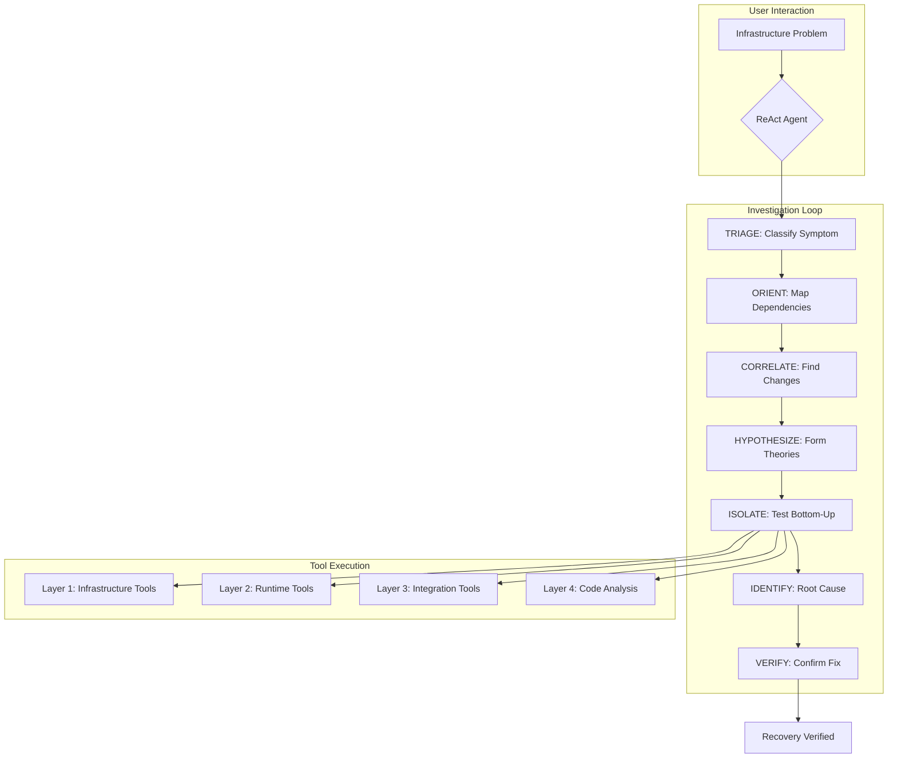

# OATS: Infrastructure Co-Pilot 🔧

**O**bservability-**A**ware **T**roubleshooting **S**ystem - An autonomous SRE agent for diagnosing and resolving infrastructure failures in cloud distributed systems.

> **📦 Cloud-Ready Structure**: OATS is now organized for cloud deployment with Kubernetes. See [README-CLOUD.md](./README-CLOUD.md) for the migration guide and new architecture.

OATS is a Python-based framework that transforms high-level infrastructure problems into systematic root cause analysis (RCA), powered by a blend of Large Language Models (LLMs) and deterministic execution. It embodies the expertise of a principal Site Reliability Engineer, applying the **Universal RCA Framework** to diagnose failures across the four layers of distributed systems.

The core of OATS is a **ReAct (Reflect-Strategize-Act)** loop that systematically progresses through seven investigation phases, testing hypotheses bottom-up through infrastructure layers, building evidence chains, and verifying fixes with observable recovery signals.

---

## Core Concepts 📚

### The Universal RCA Framework

OATS implements a structured approach to infrastructure troubleshooting:

1. **The Four-Layer Model**: Every distributed system failure manifests through four layers:
   - **Layer 4: BUSINESS LOGIC** - Code, algorithms, business rules
   - **Layer 3: INTEGRATION** - APIs, databases, caches, queues
   - **Layer 2: RUNTIME** - Processes, memory, CPU, containers
   - **Layer 1: INFRASTRUCTURE** - Network, disk, hosts, DNS

2. **The Seven Investigation Phases**:
   - **TRIAGE** → Classify symptom into a layer
   - **ORIENT** → Map system architecture & dependencies
   - **CORRELATE** → Find what changed (timeline reconstruction)
   - **HYPOTHESIZE** → Form layer-specific testable theories
   - **ISOLATE** → Test hypotheses bottom-up through layers
   - **IDENTIFY** → Trace to root cause using "five whys"
   - **VERIFY** → Fix and confirm recovery with observable signals

3. **Core Philosophy**:
   - **Hypothesis-Driven Action**: Every action tests a specific, falsifiable claim
   - **Safety-First Execution**: Observe before acting; changes must be small and reversible
   - **Evidence-Based Reasoning**: Facts from the live system over assumptions

### Key Components

- **Goal**: A high-level infrastructure problem (e.g., "Why is the API returning 504 errors?")
- **ReAct Agent**: The autonomous SRE that executes the investigation loop
- **Tools**: Atomic, versioned capabilities for system observation and remediation
- **State**: Comprehensive diagnostic state including:
  - **Facts**: Observable, verified truths with layer classification
  - **Timeline**: Chronological record of changes
  - **Causal Chain**: Links from symptom → proximate cause → root cause
  - **Competing Hypotheses**: Alternative theories with discriminating tests
  - **Layer Status**: Health assessment of each layer
- **Memory**: Long-term storage for learning from past incidents
- **Registry**: Catalog of all available diagnostic tools

---

## High-Level Architecture



---

## 📁 Project Structure

```
oats/
├── services/                      # Cloud services (NEW)
│   ├── backend-api/              # FastAPI server for job management
│   ├── agent/                    # Containerized OATS agent
│   │   ├── agent/                # Container entrypoint
│   │   ├── core/                 # Core logic
│   │   ├── reactor/              # ReAct agent
│   │   ├── tools/                # SRE tools
│   │   ├── executor/             # Tool execution
│   │   ├── orchestrator/         # Orchestration
│   │   ├── registry/             # Tool registry
│   │   └── memory/               # Memory storage
│   └── ui/                       # Frontend (Phase 3)
├── infra/                        # Kubernetes manifests (NEW)
│   └── base/                     # Base K8s resources
├── README.md                     # This file
└── README-CLOUD.md               # Cloud migration guide
```

## 🚀 Getting Started

### Option 1: Local Development (Original)

```bash
# Navigate to agent directory
cd services/agent

# Install dependencies
pip install -r requirements.txt

# Set your API key
export OPENAI_API_KEY="sk-..."
# OR
export ANTHROPIC_API_KEY="..."

# Configure LLM provider (optional - defaults to OpenAI)
export UFFLOW_LLM_PROVIDER="openai"  # or "claude"
```

**Run an investigation:**

```python
import sys
from pathlib import Path
sys.path.insert(0, str(Path.cwd()))

from reactor.agent_controller import AgentController
from registry.main import Registry

# Initialize
registry = Registry()
registry.discover_and_load_ufs()
agent = AgentController(registry)

# Diagnose an infrastructure issue
result = agent.execute_goal(
    goal="The API is returning 504 Gateway Timeout errors. Diagnose the root cause.",
    max_turns=15
)

print(result.execution_summary)
```

### Option 2: Containerized Execution

```bash
# Build the agent container
cd services/agent
docker build -t oats-agent:latest .

# Run investigation
docker run \
  -e OATS_GOAL="Why is the API returning 504 errors?" \
  -e OPENAI_API_KEY="your-key" \
  -v $(pwd)/output:/output \
  oats-agent:latest
```

### Option 3: Cloud Deployment (Kubernetes)

See [README-CLOUD.md](./README-CLOUD.md) for complete deployment guide.

```bash
# Quick start
kubectl apply -f infra/base/
curl -X POST http://backend-api/api/v1/jobs \
  -d '{"goal": "Diagnose API 504 errors", "max_turns": 15}'
```

---

## Implementation Details

### SRE Tools (`tools/sre_tools.py`)

OATS provides specialized tools for each layer of the stack:

#### Layer 1 & 2: Infrastructure & Runtime
- `check_system_health` - Comprehensive health check (disk, memory, CPU, network)
- `check_dependency` - Verify connectivity to dependencies (databases, APIs, caches)

#### Layer 3: Integration
- `check_service_health` - Test service health endpoints
- `analyze_logs` - Search logs for errors and patterns

#### Cross-Layer Analysis
- `check_recent_changes` - Timeline reconstruction (git, system changes)

### Creating Custom Tools

Extend OATS with domain-specific tools using the `@uf` decorator:

```python
from pydantic import Field
from core.sdk import uf, UfInput

class CheckDatabaseInput(UfInput):
    db_host: str = Field(..., description="Database hostname")
    query: str = Field(..., description="Health check query")

@uf(name="check_database", version="1.0.0",
   description="Execute database health check query")
def check_database(inputs: CheckDatabaseInput) -> dict:
    # Your implementation
    return {
        "success": True,
        "latency_ms": 45,
        "message": "Database healthy"
    }
```

### State Tracking for SRE Work

The `State` model captures comprehensive diagnostic information:

```python
{
  "goal": "Diagnose API 504 errors",
  "tasks": [
    {"id": 1, "desc": "Identify root cause", "status": "active"}
  ],
  "facts": [
    {
      "id": 1,
      "desc": "DB queries timing out after 30s",
      "turn": 3,
      "layer": "INTEGRATION"
    }
  ],
  "diagnosis": {
    "symptom": {
      "description": "API returns 504",
      "layer": "INTEGRATION",
      "scope": "15% of requests"
    },
    "timeline": [
      {
        "timestamp": "2024-10-06T14:20:00Z",
        "event": "Deploy v2.3.1",
        "relevance": "HIGH"
      }
    ],
    "causalChain": [
      {
        "level": "symptom",
        "layer": "INTEGRATION",
        "description": "API returns 504",
        "factIDs": [1]
      },
      {
        "level": "root_cause",
        "layer": "BUSINESS_LOGIC",
        "description": "Missing index causes full table scan",
        "factIDs": [2, 4]
      }
    ],
    "layerStatus": {
      "INFRASTRUCTURE": "HEALTHY",
      "RUNTIME": "HEALTHY",
      "INTEGRATION": "DEGRADED",
      "BUSINESS_LOGIC": "SUSPECT"
    }
  }
}
```

---

## Configuration

### Environment Variables

```bash
# LLM Configuration
UFFLOW_LLM_PROVIDER=claude          # or "openai"
UFFLOW_LLM_MODEL=claude-3-5-sonnet-20241022
UFFLOW_TEMPERATURE=0.1
UFFLOW_MAX_TOKENS=4000

# ReAct Configuration
UFFLOW_MAX_TURNS=15                 # Max investigation turns
UFFLOW_PROMPT_VERSION=v3            # SRE prompt version

# Logging
UFFLOW_LOG_LEVEL=INFO
```

### Prompt Versions

OATS supports versioned prompts in `reactor/prompts/`:
- **v3.txt** (default) - Universal RCA Framework for infrastructure troubleshooting
- **v2.txt** - Alternative SRE prompt
- **v1.txt** - General-purpose agent prompt

Change prompt version: `export UFFLOW_PROMPT_VERSION=v3`

---

## Investigation Patterns

### The Change Detective (Timeline Reconstruction)
**When**: "It was working, now it's broken" OR recent deployment suspected
**Process**: Establish "last known good" → Find all changes → Test most likely via rollback

### The Resource Hunter (Invariant Checking)
**When**: Performance degradation, crashes, OOM kills, high latency
**Process**: Check four resources (CPU/Memory/Disk/Network) → Identify constrained resource → Trace why consumption increased

### The Dependency Tracer (Blast Radius Analysis)
**When**: Cascading failures, "service unavailable", connectivity issues
**Process**: Map dependency graph → Check upstream health → Check downstream impact → Verify network path

### Differential Diagnosis
**When**: Multiple plausible explanations exist
**Process**: List competing hypotheses → Define discriminators → Test discriminator that eliminates most hypotheses

---

## Critical Success Factors

1. **Follow The Method**: Progress through 7 phases systematically
2. **Layer-Aware**: Test bottom-up (L1→L2→L3→L4)
3. **Context First**: Complete ORIENT before theorizing
4. **Timeline is Key**: Find what changed
5. **One Action, One Test**: Each turn tests one hypothesis
6. **Build Evidence**: Link facts via factIDs in causal chain
7. **Verify Recovery**: All 4 signals before claiming success:
   - Metrics back to normal
   - Health checks passing
   - Error logs stopped
   - End-to-end tests succeeding
8. **Classify Failures**: Execution vs Strategic (use correct recovery path)
9. **Track Confidence**: Update after each turn
10. **Know When to Escalate**: After 3 failed approaches or need user input

---

## Roadmap

### Current: V1.0 - Autonomous RCA Engine
- ✅ Universal RCA Framework implementation
- ✅ Four-layer system model
- ✅ Seven-phase investigation workflow
- ✅ SRE-specific tools and state tracking
- ✅ Timeline reconstruction and differential diagnosis

### V1.5: Multi-Cloud Integration
- [ ] AWS CloudWatch integration
- [ ] Kubernetes diagnostics tools
- [ ] Prometheus/Grafana metric queries
- [ ] Distributed tracing integration (Jaeger/Zipkin)

### V2.0: Collaborative SRE Team
- [ ] Multi-agent collaboration for complex incidents
- [ ] Incident commander agent for coordination
- [ ] Parallel hypothesis testing
- [ ] Automated runbook generation

### V3.0: Predictive SRE
- [ ] Anomaly detection before failures
- [ ] Proactive capacity planning
- [ ] Learning from incident history
- [ ] Automated remediation playbooks

---

## Contributing

We welcome contributions! Areas of interest:
- Cloud provider integrations (AWS, GCP, Azure)
- Kubernetes troubleshooting tools
- Observability platform connectors
- RCA pattern libraries
- Case studies and runbooks

---

## License

MIT License - See LICENSE file for details

---

## Support

- **Documentation**: [docs/](docs/)
- **Issues**: [GitHub Issues](https://github.com/yourusername/oats/issues)
- **Discord**: [Join our community](https://discord.gg/oats)

---

**Built with ❤️ for SREs who debug distributed systems**
