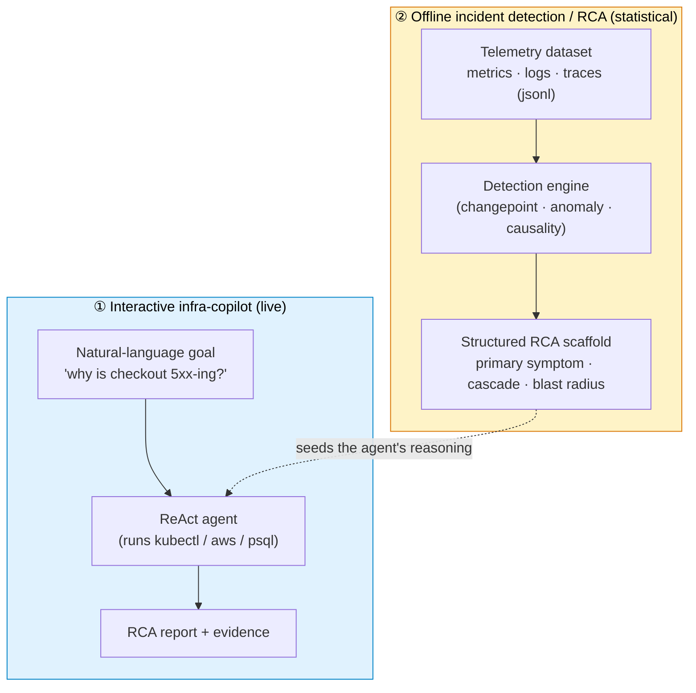
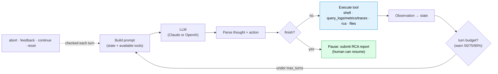
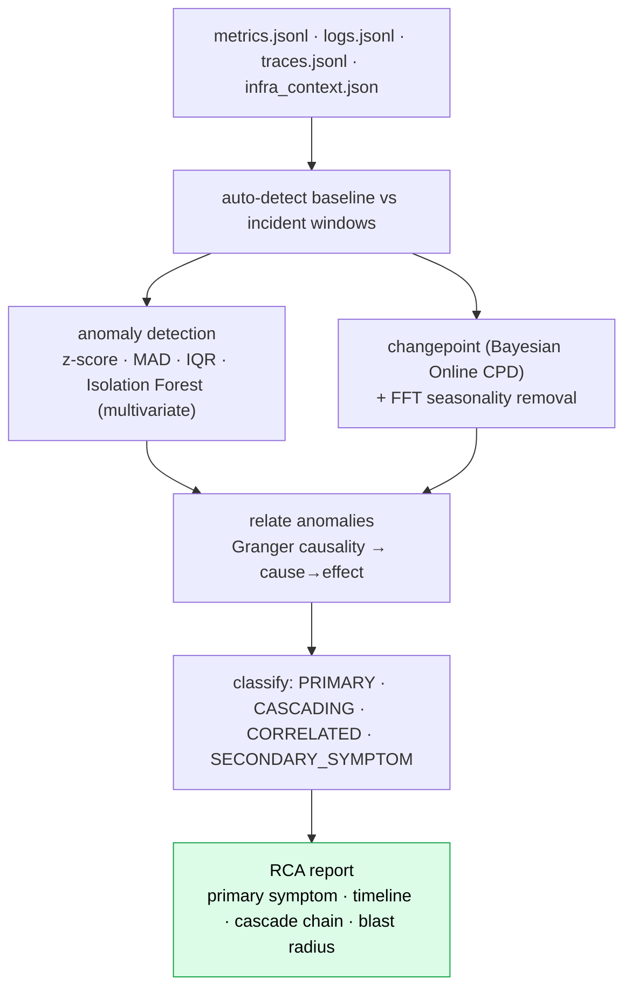
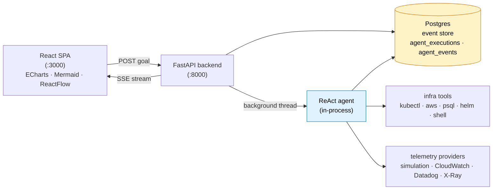

<div align="center">

# OATS

**An autonomous SRE agent that diagnoses infrastructure incidents — and proves the root cause.**

*OATS pairs a tool-using ReAct agent that runs real infra commands (`kubectl`, `aws`, `psql`, `helm`) against a live cluster with a statistical incident-detection engine that mines telemetry for the true root cause, its cascade, and its blast radius.*

Python · FastAPI · React · dual-LLM (Claude / OpenAI) · event-sourced · resumable

</div>

---

## The problem

When infra breaks, an engineer spends the first painful hour doing the same things by hand: pulling metrics and logs, running `kubectl` and `aws` commands, guessing which anomaly is the *cause* versus a downstream *symptom*, and mapping the blast radius. It's slow, it's stressful, and the reasoning rarely gets written down.

OATS does both halves of that job. A **statistical engine** reads the telemetry and separates the primary symptom from its cascade with real methods (changepoint detection, Granger causality, multivariate anomaly detection). An **autonomous agent** then investigates the live environment with actual CLI tools, and submits a structured RCA report — every step event-sourced so a human can watch, interrupt, correct, and resume.

---

## Two modes, one system


```mermaid
flowchart TB
    subgraph LIVE["① Interactive infra-copilot (live)"]
        direction LR
        G["Natural-language goal<br/>'why is checkout 5xx-ing?'"] --> AG["ReAct agent<br/>(runs kubectl / aws / psql)"]
        AG --> RPT1["RCA report + evidence"]
    end
    subgraph OFF["② Offline incident detection / RCA (statistical)"]
        direction LR
        TEL["Telemetry dataset<br/>metrics · logs · traces (jsonl)"] --> ENG["Detection engine<br/>(changepoint · anomaly · causality)"]
        ENG --> RPT2["Structured RCA scaffold<br/>primary symptom · cascade · blast radius"]
    end
    RPT2 -. seeds the agent's reasoning .-> AG

    style LIVE fill:#e0f2fe,stroke:#0284c7,color:#000
    style OFF fill:#fef3c7,stroke:#d97706,color:#000
```

The offline engine's output is a *ready-made RCA scaffold* the agent can build on — the model doesn't have to rediscover which anomaly came first; the statistics already told it.

---

## The agent: an event-sourced ReAct loop

The agent reasons in turns — **Thought → Action (a real tool call) → Observation** — until it calls `finish` to submit its RCA. Every step is appended to a Postgres event store, streamed to the UI over SSE, and the loop checks for human interrupts each turn. `finish` *pauses* rather than kills, so a person can review and steer.


```mermaid
flowchart LR
    P["Build prompt<br/>(state + available tools)"] --> LLM["LLM<br/>(Claude or OpenAI)"]
    LLM --> PA["Parse thought + action"]
    PA --> CK{"finish?"}
    CK -->|no| TX["Execute tool<br/>shell · query_logs/metrics/traces · rca · files"]
    TX --> OB["Observation → state"]
    OB --> BUD{"turn budget?<br/>(warn 50/75/90%)"}
    BUD -->|under max_turns| P
    CK -->|yes| FIN["Pause: submit RCA report<br/>(human can resume)"]

    ITR["abort · feedback · continue · reset"] -. checked each turn .-> P

    style FIN fill:#dcfce7,stroke:#16a34a,color:#000
    style TX fill:#e0f2fe,stroke:#0284c7,color:#000
```

- **Tools are auto-discovered** — anything decorated `@uf(...)` registers itself: `execute_shell` (the primary infra action), `query_logs` / `query_metrics` / `query_traces`, `search_code`, `query_commits`, the RCA toolset, and `finish`.
- **Turn-budget governance** — warnings at 50/75/90% push the agent to converge (the design target: 12-turn investigations down to 2–3).
- **Provider abstraction** — telemetry comes from a pluggable backend (simulation today; CloudWatch / Datadog / X-Ray / GitHub providers scaffolded).
- **LLM produces data; the UI picks the visualization** — a universal artifact-metadata contract lets the frontend auto-render a logs viewer, timeline, Mermaid graph, topology, or timeseries without the model choosing a chart type.

---

## The RCA engine: separating cause from symptom

Given a telemetry directory, the engine auto-discovers the baseline and incident windows (no hardcoded times), detects anomalies with several independent methods, then classifies how they relate — so the **primary symptom** (root-cause candidate) is distinguished from everything it knocked over.


```mermaid
flowchart TD
    T["metrics.jsonl · logs.jsonl · traces.jsonl · infra_context.json"] --> W["auto-detect baseline vs incident windows"]
    W --> A["anomaly detection<br/>z-score · MAD · IQR · Isolation Forest (multivariate)"]
    W --> C["changepoint (Bayesian Online CPD)<br/>+ FFT seasonality removal"]
    A --> R["relate anomalies<br/>Granger causality → cause→effect"]
    C --> R
    R --> CL["classify: PRIMARY · CASCADING · CORRELATED · SECONDARY_SYMPTOM"]
    CL --> OUT["RCA report<br/>primary symptom · timeline · cascade chain · blast radius"]

    style OUT fill:#dcfce7,stroke:#16a34a,color:#000
```

The RCA library also exposes ~15 investigation tools to the agent in four groups — *situational* (blast radius, temporal timeline, recent changes), *comparison* (metrics/logs/traces vs baseline), *validation* (service dependencies, instance/DB/cache health), and *completion* (`finish`). Each takes a `reference_time` + `lookback`, so the same tools work live or post-incident.

---

## System architecture


```mermaid
flowchart LR
    UI["React SPA<br/>(:3000)<br/>ECharts · Mermaid · ReactFlow"] -->|POST goal| API["FastAPI backend<br/>(:8000)"]
    API -->|SSE stream| UI
    API --> ES[("Postgres<br/>event store<br/>agent_executions · agent_events")]
    API -->|background thread| AGENT["ReAct agent<br/>(in-process)"]
    AGENT --> ES
    AGENT --> TOOLS["infra tools<br/>kubectl · aws · psql · helm · shell"]
    AGENT --> PROV["telemetry providers<br/>simulation · CloudWatch · Datadog · X-Ray"]

    style ES fill:#fef3c7,stroke:#d97706,color:#000
    style AGENT fill:#e0f2fe,stroke:#0284c7,color:#000
```

Everything is **event-sourced**: an execution is a row in `agent_executions`; every turn/tool-call/warning/finish is an append to `agent_events`. The SSE endpoint replays events since a cursor and never auto-closes, so reconnects resume seamlessly and the whole run is auditable and resumable.

> **Note on the live path:** each execution currently runs the agent in a **background thread inside the backend process** (not a per-execution Kubernetes Job — that topology is scaffolded in `docs/` and `infra/` but not the current runtime path).

---

## Quick start (local)

```bash
# Postgres (event store)
brew services start postgresql@15 && createdb oats

# .env: OPENAI_API_KEY, ANTHROPIC_API_KEY, DATABASE_URL
python run_all.py        # cleans :8000/:3000, inits DB, starts backend + UI
# → UI at http://localhost:3000, API at http://localhost:8000
```

Run the offline RCA pipeline on a telemetry dataset:

```bash
python run_incident_detection.py <data_dir> --relative-time
# → writes incident_detection_report.json (primary symptom, timeline, cascade, blast radius)
```

Run the agent standalone (one goal, headless):

```bash
cd services/agent
export OATS_GOAL="Give me the health of the cluster" OPENAI_API_KEY=...
python -m agent.main       # writes /output/result.json
```

---

## Deploy (AWS EKS)

```bash
make setup                 # first-time cluster setup
make deploy-all            # build linux/amd64 images → push to ECR → rollout
make urls status logs-backend
# infra-copilot permissions (cluster-wide read + AWS IRSA):
kubectl apply -f infra/base/rbac.yaml
bash infra/aws/setup-irsa.sh
```

`./DEPLOY.sh` is an idempotent all-in-one EKS deploy (sources `.env.aws`, provisions secrets from `ANTHROPIC_API_KEY`).

---

## Tech stack

| Layer | Tech |
|---|---|
| **Agent / LLM** | dual-provider client — Claude (`claude-sonnet-4-5`) and OpenAI (`gpt-4o`), selected by model prefix; `tiktoken`, ReAct loop with versioned prompts (v1→v7) |
| **RCA / stats** | `numpy`, `scipy`, `ruptures` (changepoint), `drain3` (log-template mining), `networkx`; Bayesian Online CPD, Isolation Forest, Granger causality, FFT seasonality |
| **Backend** | FastAPI, Uvicorn, Pydantic, `sse-starlette`, `psycopg2` (Postgres event store), `kubernetes` client |
| **UI** | React 18, Zustand, ECharts, Mermaid, ReactFlow + elkjs, react-markdown |
| **Infra** | Docker (`linux/amd64`), AWS EKS, ECR, IAM/IRSA, PostgreSQL, nginx |

---

## Layout

```text
run_all.py                 # local dev launcher (Postgres + backend + UI)
run_incident_detection.py  # offline RCA pipeline CLI
Makefile / DEPLOY.sh       # EKS/ECR build-push-deploy
services/
  agent/                   # the ReAct SRE agent
    reactor/               # the main loop (agent_controller) + versioned prompts
    tools/                 # @uf tools: shell, observability, filesystem, sre, rca bridge
    registry/              # auto-discovery of @uf tools
    core/                  # config, dual-LLM client, sdk (@uf), path/workspace security
    providers/             # telemetry providers (cloudwatch/datadog/xray/github)
    rca/                   # the statistical engine: detection + 15 RCA tools + analyzers + backends
  backend-api/             # FastAPI app + Postgres event store (schema.sql, event_store.py)
  ui/                      # React SPA (SSE, artifact visualizations)
infra/                     # K8s manifests (rbac, deployments, jobs) + AWS IAM/IRSA
scripts/                   # ops helpers (logs, restart, cost-control, reset_db)
docs/                      # design docs (event-driven arch, SSE, artifacts, resume, cloud)
output/                    # generated telemetry/incident datasets
test_artifacts/            # sample artifact JSONs to exercise UI visualizations
```

---

## What makes it distinctive

- **It actually acts.** The agent runs real `kubectl` / `aws` / `psql` / `helm` with cluster-wide read and account-wide AWS read — not a read-only chatbot describing what you *could* run.
- **Statistics find the root cause, not keyword matching.** Granger causality infers cause→effect between metric series; changepoint + multivariate anomaly detection separate the primary symptom from its cascade — a real RCA scaffold, before the LLM ever reasons.
- **Auditable, interruptible, resumable.** Every turn is an event; the run streams live; a human can abort, inject feedback, continue, or reset mid-investigation, and `finish` pauses for review rather than ending.
- **No hardcoded incident windows.** Windows are auto-discovered and every tool is time-relative, so the same engine works live and post-mortem.
- **Model produces data; UI owns visualization.** A universal artifact contract eliminates chart-type hallucination and auto-renders the right view.
