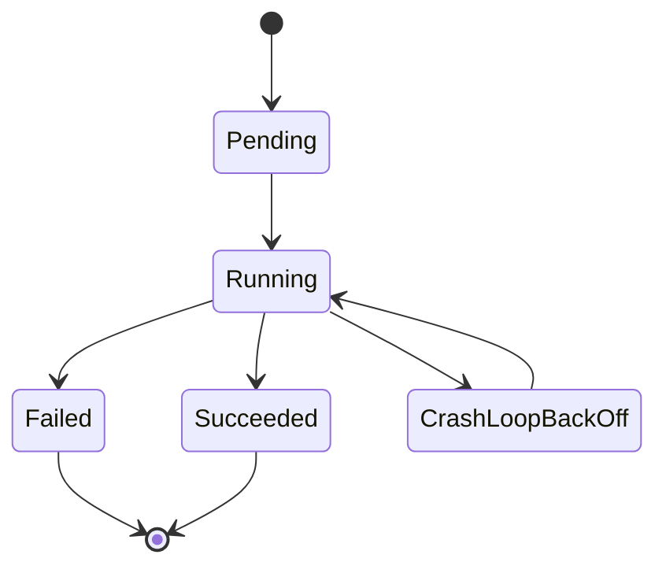
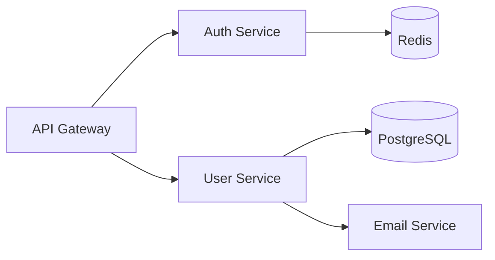
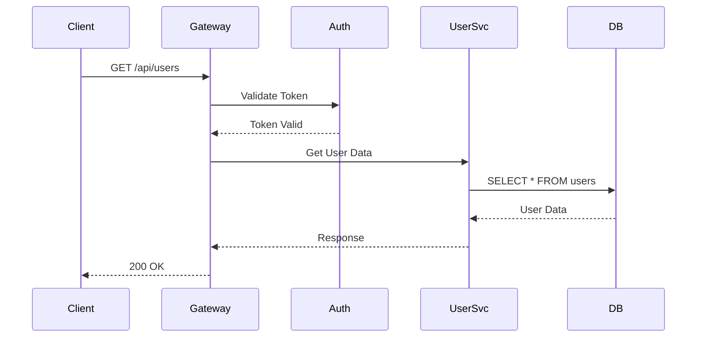
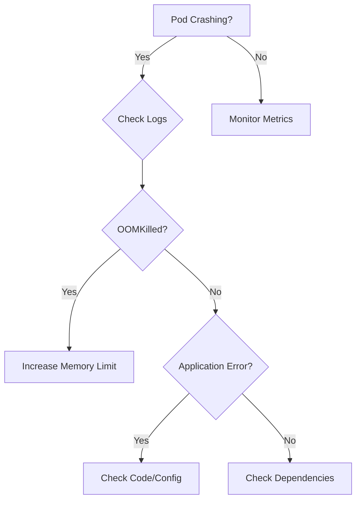
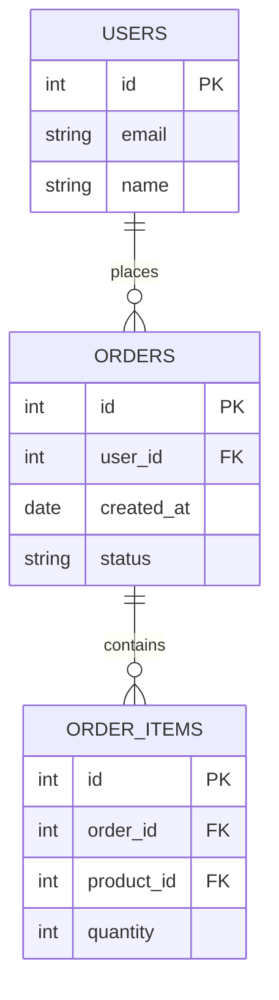
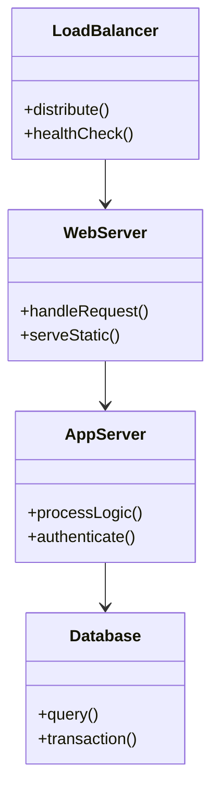

# Dynamic Visualization Implementation Plan

## Overview

This document outlines the plan to add interactive, investigative visualizations to the OATS infra-copilot UI. The goal is to provide visual understanding of complex infrastructure issues through dynamic, agent-driven visualizations that users can explore, filter, zoom, pin, and export.

## Architecture Concept

### Agent-Driven Visualization Flow

```
┌─────────────────────────────────────────────────────────────┐
│ Agent Investigation Flow                                     │
├─────────────────────────────────────────────────────────────┤
│ User: "Why is pod-xyz crashing?"                            │
│   ↓                                                          │
│ Agent uses kubectl tools → gets metrics, logs, events       │
│   ↓                                                          │
│ Agent generates visualization specs:                        │
│   - topology (pod relationships)                            │
│   - timeseries (memory usage with OOM spike highlighted)    │
│   - mermaid (diagrams: flowcharts, state, sequence, etc.)   │
│   - logs (filtered for ERROR level around crash time)       │
│   - trace (request path through services)                   │
│   ↓                                                          │
│ Backend emits events with artifact_type="visualization"     │
│   ↓                                                          │
│ Frontend renders interactive visualizations                 │
│   ↓                                                          │
│ User interacts:                                              │
│   - Zooms into OOM spike timeframe                          │
│   - Clicks metric → logs auto-filter to that timeframe      │
│   - Pins visualization for reference                        │
│   - Downloads screenshot + raw data                         │
└─────────────────────────────────────────────────────────────┘
```

### Key Principles

1. **Declarative Specifications**: Agent generates visualization specs (not just raw data)
2. **Rich Interaction**: Frontend provides zoom, filter, drill-down capabilities
3. **Context Preservation**: Users can pin visualizations for reference during investigation
4. **Export Capabilities**: Screenshot and download raw data for reports
5. **Cross-Visualization Correlation**: Click metric spike → auto-filter logs to that timeframe

---

## Technology Stack

### Package Dependencies

```json
{
  "dependencies": {
    // === Topology & Graphs ===
    "reactflow": "^11.10.4",         // Interactive node graphs
    "elkjs": "^0.9.1",               // Auto-layout algorithms

    // === Charts & Metrics ===
    "echarts": "^5.4.3",             // Rich, interactive charts
    "echarts-for-react": "^3.0.2",   // React wrapper for ECharts

    // === Diagrams (Mermaid) ===
    "mermaid": "^10.6.1",            // Mermaid diagram rendering
    "react-mermaid2": "^2.0.0",      // React wrapper for Mermaid

    // === Advanced Log Viewing ===
    "react-virtuoso": "^4.6.2",      // Virtual scrolling for large logs
    "react-resizable-panels": "^1.0.0", // Resizable log panels

    // === Export & Screenshots ===
    "html2canvas": "^1.4.1",         // Screenshot DOM elements
    "file-saver": "^2.0.5",          // Download files

    // === State Management (for pinning) ===
    "zustand": "^4.4.7",             // Lightweight state management

    // === Utilities ===
    "date-fns": "^2.30.0",           // Date formatting/manipulation
    "lodash": "^4.17.21"             // Utilities
  }
}
```

**Bundle size impact:** ~500KB gzipped

### Library Rationale

| Library | Purpose | Why This Choice |
|---------|---------|-----------------|
| reactflow | Infrastructure topology graphs | Best-in-class for interactive node graphs, excellent performance |
| echarts | Time-series metrics | Handles 100k+ datapoints, rich interactions, monitoring-grade quality |
| mermaid | Architecture diagrams & flowcharts | Text-based, agent can generate easily, supports many diagram types |
| react-virtuoso | Log virtualization | Better API than react-window, handles variable heights |
| html2canvas | Screenshots | Most mature DOM-to-image solution |
| zustand | State management | Lightweight, no boilerplate, perfect for pinning feature |

---

## Phase 1: Infrastructure Setup (Week 1)

### Goals
- Set up visualization framework
- Create base components and routing
- Establish visualization specification format
- Install dependencies

### Tasks

#### 1.1 Install Dependencies

```bash
cd services/ui
npm install reactflow elkjs echarts echarts-for-react mermaid react-mermaid2 react-virtuoso react-resizable-panels html2canvas file-saver zustand date-fns lodash
```

#### 1.2 Create Directory Structure

```
services/ui/src/
├── components/
│   ├── visualizations/
│   │   ├── VisualizationViewer.js       // Main viz router
│   │   ├── TopologyViewer.js            // Infrastructure graphs
│   │   ├── TimeSeriesViewer.js          // Metrics with anomalies
│   │   ├── MermaidViewer.js             // Mermaid diagrams (flowcharts, etc.)
│   │   ├── LogViewer.js                 // Advanced log filtering
│   │   ├── TraceViewer.js               // Distributed traces
│   │   ├── VisualizationControls.js     // Export/pin controls
│   │   ├── PinnedVisualizationsPanel.js // Sidebar for pinned viz
│   │   └── styles/
│   │       ├── VisualizationViewer.css
│   │       ├── TopologyViewer.css
│   │       ├── TimeSeriesViewer.css
│   │       ├── MermaidViewer.css
│   │       ├── LogViewer.css
│   │       └── TraceViewer.css
│   │
│   └── ArtifactViewer.js                // Extend this component
│
├── store/
│   └── visualizationStore.js            // Zustand store for pinning
│
└── utils/
    ├── exportUtils.js                   // Screenshot & download helpers
    └── visualizationParser.js           // Parse viz specs
```

#### 1.3 Visualization Specification Format

All visualizations follow a consistent JSON schema:

```json
{
  "type": "topology|timeseries|mermaid|logs|trace",
  "title": "Human-readable title",
  "timestamp": "ISO-8601 timestamp",
  "metadata": {
    "namespace": "kubernetes namespace",
    "cluster": "cluster name",
    "generated_by": "tool name"
  },
  "data": {
    // Type-specific data structure
  }
}
```

#### 1.4 Extend ArtifactViewer

Update `services/ui/src/components/ArtifactViewer.js` to handle visualization artifacts:

```javascript
// Add to renderContent() switch statement
case 'visualization':
  return renderVisualization();

// New render function
const renderVisualization = () => {
  try {
    const vizSpec = JSON.parse(content);
    return <VisualizationViewer spec={vizSpec} artifactPath={artifactPath} />;
  } catch (e) {
    return renderPlainText();
  }
};
```

#### 1.5 Create Base VisualizationViewer Component

**File:** `services/ui/src/components/visualizations/VisualizationViewer.js`

```javascript
import React, { useState, useEffect } from 'react';
import TopologyViewer from './TopologyViewer';
import TimeSeriesViewer from './TimeSeriesViewer';
import MermaidViewer from './MermaidViewer';
import LogViewer from './LogViewer';
import TraceViewer from './TraceViewer';
import './styles/VisualizationViewer.css';

const VisualizationViewer = ({ spec, artifactPath }) => {
  const vizId = `viz-${Date.now()}-${Math.random().toString(36).substr(2, 9)}`;

  const renderVisualization = () => {
    switch (spec.type) {
      case 'topology':
        return <TopologyViewer spec={spec} vizId={vizId} />;
      case 'timeseries':
        return <TimeSeriesViewer spec={spec} vizId={vizId} />;
      case 'mermaid':
        return <MermaidViewer spec={spec} vizId={vizId} />;
      case 'logs':
        return <LogViewer spec={spec} vizId={vizId} />;
      case 'trace':
        return <TraceViewer spec={spec} vizId={vizId} />;
      default:
        return (
          <div className="viz-error">
            Unknown visualization type: {spec.type}
          </div>
        );
    }
  };

  return (
    <div id={vizId} className="visualization-container">
      {renderVisualization()}
    </div>
  );
};

export default VisualizationViewer;
```

---

## Phase 2: Core Visualizations (Week 2-3)

### Phase 2.1: Infrastructure Topology Viewer

#### Specification Format

```json
{
  "type": "topology",
  "title": "Service Dependencies - prod namespace",
  "timestamp": "2025-10-16T10:30:00Z",
  "metadata": {
    "namespace": "prod",
    "cluster": "us-west-2"
  },
  "data": {
    "nodes": [
      {
        "id": "service-a",
        "label": "Service A",
        "type": "service",
        "status": "healthy|degraded|unhealthy",
        "position": {"x": 0, "y": 0},
        "metadata": {
          "replicas": 3,
          "cpu_usage": "45%",
          "memory_usage": "512MB"
        }
      }
    ],
    "edges": [
      {
        "id": "edge-1",
        "source": "service-a",
        "target": "service-b",
        "label": "HTTP",
        "type": "http|grpc|tcp|database"
      }
    ],
    "highlights": ["service-b"],
    "annotations": {
      "service-b": "High error rate detected (15% of requests)"
    },
    "layout": "hierarchical|force|circular"
  }
}
```

#### Component Implementation

**File:** `services/ui/src/components/visualizations/TopologyViewer.js`

```javascript
import React, { useCallback, useMemo } from 'react';
import ReactFlow, {
  Background,
  Controls,
  MiniMap,
  useNodesState,
  useEdgesState,
  MarkerType,
} from 'reactflow';
import 'reactflow/dist/style.css';
import { VisualizationControls } from './VisualizationControls';
import './styles/TopologyViewer.css';

const TopologyViewer = ({ spec, vizId }) => {
  // Transform spec nodes to ReactFlow format
  const initialNodes = useMemo(() => {
    return spec.data.nodes.map(node => ({
      id: node.id,
      data: {
        label: node.label,
        type: node.type,
        metadata: node.metadata,
        annotation: spec.data.annotations?.[node.id]
      },
      position: node.position,
      style: {
        backgroundColor: getNodeColor(node.status),
        border: spec.data.highlights?.includes(node.id) ? '3px solid #ff0000' : '1px solid #888',
        borderRadius: '8px',
        padding: '10px',
        color: '#fff'
      },
      type: 'default'
    }));
  }, [spec]);

  const initialEdges = useMemo(() => {
    return spec.data.edges.map(edge => ({
      id: edge.id,
      source: edge.source,
      target: edge.target,
      label: edge.label,
      markerEnd: {
        type: MarkerType.ArrowClosed,
      },
      style: { stroke: '#888' },
      type: 'smoothstep'
    }));
  }, [spec]);

  const [nodes, setNodes, onNodesChange] = useNodesState(initialNodes);
  const [edges, setEdges, onEdgesChange] = useEdgesState(initialEdges);

  const onNodeClick = useCallback((event, node) => {
    console.log('Node clicked:', node);
    // TODO: Show node details in modal/sidebar
  }, []);

  return (
    <div className="topology-viewer">
      <div className="topology-header">
        <h3>{spec.title}</h3>
        <VisualizationControls vizId={vizId} spec={spec} type="topology" />
      </div>
      <div style={{ height: '600px', backgroundColor: '#1e1e1e' }}>
        <ReactFlow
          nodes={nodes}
          edges={edges}
          onNodesChange={onNodesChange}
          onEdgesChange={onEdgesChange}
          onNodeClick={onNodeClick}
          fitView
          attributionPosition="bottom-left"
        >
          <Background color="#555" gap={16} />
          <Controls />
          <MiniMap
            nodeColor={(node) => node.style.backgroundColor}
            maskColor="rgba(0, 0, 0, 0.6)"
          />
        </ReactFlow>
      </div>
    </div>
  );
};

function getNodeColor(status) {
  switch (status) {
    case 'healthy': return '#4caf50';
    case 'degraded': return '#ff9800';
    case 'unhealthy': return '#f44336';
    default: return '#2196f3';
  }
}

export default TopologyViewer;
```

#### Use Cases
- Kubernetes: Cluster → Nodes → Pods → Containers
- Service mesh: Services and their HTTP/gRPC connections
- Database dependencies: Services → Connection pools → DB instances
- Network topology: Subnets, security groups, load balancers

---

### Phase 2.2: Time-Series Metrics Viewer

#### Specification Format

```json
{
  "type": "timeseries",
  "title": "Pod Memory Usage - Namespace: prod",
  "timestamp": "2025-10-16T10:30:00Z",
  "metadata": {
    "namespace": "prod",
    "metric_type": "memory_usage"
  },
  "data": {
    "yAxisLabel": "Memory (MB)",
    "series": [
      {
        "name": "pod-abc-123",
        "data": [
          [1697385600000, 256],
          [1697385660000, 512],
          [1697385720000, 1024]
        ]
      }
    ],
    "anomalies": [
      {
        "start": 1697385700000,
        "end": 1697385720000,
        "reason": "OOMKilled - Memory spike to 1.2GB",
        "severity": "critical|warning|info"
      }
    ],
    "events": [
      {
        "timestamp": 1697385710000,
        "label": "Deployment",
        "description": "Deployed version 1.2.3"
      }
    ]
  }
}
```

#### Component Implementation

**File:** `services/ui/src/components/visualizations/TimeSeriesViewer.js`

```javascript
import React, { useRef, useState } from 'react';
import ReactECharts from 'echarts-for-react';
import { VisualizationControls } from './VisualizationControls';
import './styles/TimeSeriesViewer.css';

const TimeSeriesViewer = ({ spec, vizId }) => {
  const chartRef = useRef(null);
  const [selectedTimeRange, setSelectedTimeRange] = useState(null);

  const option = {
    title: {
      text: spec.title,
      textStyle: { color: '#fff' },
      left: 'center'
    },
    tooltip: {
      trigger: 'axis',
      axisPointer: {
        type: 'cross',
        crossStyle: { color: '#999' }
      },
      backgroundColor: 'rgba(0, 0, 0, 0.8)',
      borderColor: '#666',
      textStyle: { color: '#fff' }
    },
    legend: {
      data: spec.data.series.map(s => s.name),
      textStyle: { color: '#fff' },
      top: 30
    },
    grid: {
      left: '3%',
      right: '4%',
      bottom: '15%',
      top: 80,
      containLabel: true
    },
    xAxis: {
      type: 'time',
      boundaryGap: false,
      axisLabel: {
        color: '#fff',
        formatter: (value) => {
          const date = new Date(value);
          return date.toLocaleTimeString();
        }
      },
      axisLine: { lineStyle: { color: '#666' } }
    },
    yAxis: {
      type: 'value',
      axisLabel: { color: '#fff' },
      name: spec.data.yAxisLabel || 'Value',
      nameTextStyle: { color: '#fff' },
      axisLine: { lineStyle: { color: '#666' } },
      splitLine: { lineStyle: { color: '#333' } }
    },
    series: [
      ...spec.data.series.map(s => ({
        name: s.name,
        type: 'line',
        data: s.data,
        smooth: true,
        lineStyle: { width: 2 },
        showSymbol: false,
        emphasis: { focus: 'series' }
      })),
      // Add anomaly visualization
      ...(spec.data.anomalies || []).map((anomaly, idx) => ({
        name: `Anomaly ${idx + 1}`,
        type: 'line',
        markArea: {
          silent: true,
          data: [[
            { xAxis: anomaly.start, name: anomaly.reason },
            { xAxis: anomaly.end }
          ]],
          itemStyle: {
            color: getSeverityColor(anomaly.severity)
          },
          label: {
            show: true,
            position: 'top',
            color: '#fff',
            formatter: () => anomaly.reason
          }
        }
      }))
    ],
    dataZoom: [
      {
        type: 'inside',
        start: 0,
        end: 100,
        filterMode: 'filter'
      },
      {
        type: 'slider',
        start: 0,
        end: 100,
        textStyle: { color: '#fff' },
        borderColor: '#666',
        fillerColor: 'rgba(47, 69, 84, 0.4)'
      }
    ],
    backgroundColor: '#1e1e1e',
    darkMode: true
  };

  const onChartClick = (params) => {
    if (params.componentType === 'series') {
      console.log('Clicked data point:', params);
      // Emit event to filter logs to this timestamp
      setSelectedTimeRange({
        start: params.value[0] - 300000, // 5 min before
        end: params.value[0] + 300000    // 5 min after
      });
      // TODO: Dispatch to parent to update log viewer
    }
  };

  const onDataZoom = (params) => {
    const chart = chartRef.current.getEchartsInstance();
    const option = chart.getOption();
    const xAxis = option.xAxis[0];
    // TODO: Update other visualizations based on zoom
  };

  return (
    <div className="timeseries-viewer">
      <div className="timeseries-header">
        <VisualizationControls vizId={vizId} spec={spec} type="timeseries" />
      </div>
      <ReactECharts
        ref={chartRef}
        option={option}
        style={{ height: '500px', width: '100%' }}
        onEvents={{
          click: onChartClick,
          dataZoom: onDataZoom
        }}
        theme="dark"
      />
      {selectedTimeRange && (
        <div className="selected-range-info">
          Selected: {new Date(selectedTimeRange.start).toLocaleTimeString()} -
          {new Date(selectedTimeRange.end).toLocaleTimeString()}
        </div>
      )}
    </div>
  );
};

function getSeverityColor(severity) {
  switch (severity) {
    case 'critical': return 'rgba(255, 0, 0, 0.3)';
    case 'warning': return 'rgba(255, 165, 0, 0.3)';
    case 'info': return 'rgba(0, 123, 255, 0.3)';
    default: return 'rgba(128, 128, 128, 0.3)';
  }
}

export default TimeSeriesViewer;
```

---

### Phase 2.3: Mermaid Diagram Viewer

#### Why Mermaid?

Mermaid is perfect for infra-copilot because:
- **Text-based**: Agent can generate diagrams as simple text strings
- **Versatile**: Supports flowcharts, sequence diagrams, state diagrams, Gantt charts, ER diagrams, etc.
- **Lightweight**: ~50KB, minimal bundle impact
- **Easy integration**: Works with existing react-markdown setup
- **No JSON complexity**: Agent just outputs diagram syntax, not complex data structures

#### Specification Format

```json
{
  "type": "mermaid",
  "title": "Pod Lifecycle State Diagram",
  "timestamp": "2025-10-16T10:30:00Z",
  "metadata": {
    "diagram_type": "stateDiagram|flowchart|sequence|gantt|er|classDiagram",
    "generated_by": "investigation_tool"
  },
  "data": {
    "diagram": "stateDiagram-v2\n    [*] --> Pending\n    Pending --> Running\n    Running --> Succeeded\n    Running --> Failed\n    Running --> CrashLoopBackOff\n    CrashLoopBackOff --> Running\n    Failed --> [*]\n    Succeeded --> [*]",
    "theme": "dark"
  }
}
```

#### Component Implementation

**File:** `services/ui/src/components/visualizations/MermaidViewer.js`

```javascript
import React, { useEffect, useRef } from 'react';
import mermaid from 'mermaid';
import { VisualizationControls } from './VisualizationControls';
import './styles/MermaidViewer.css';

const MermaidViewer = ({ spec, vizId }) => {
  const mermaidRef = useRef(null);
  const [error, setError] = React.useState(null);

  useEffect(() => {
    // Initialize mermaid with dark theme
    mermaid.initialize({
      startOnLoad: false,
      theme: spec.data.theme || 'dark',
      themeVariables: {
        primaryColor: '#4488ff',
        primaryTextColor: '#fff',
        primaryBorderColor: '#666',
        lineColor: '#888',
        secondaryColor: '#2c2c2c',
        tertiaryColor: '#1e1e1e',
        background: '#1e1e1e',
        mainBkg: '#2c2c2c',
        secondBkg: '#1e1e1e',
        textColor: '#fff',
        fontSize: '16px',
      },
      darkMode: true,
      securityLevel: 'strict',
      fontFamily: 'Arial, sans-serif'
    });

    // Render the diagram
    if (mermaidRef.current && spec.data.diagram) {
      try {
        // Clear previous content
        mermaidRef.current.innerHTML = '';

        // Generate unique ID for this diagram
        const diagramId = `mermaid-${vizId}`;

        // Render diagram
        mermaid.render(diagramId, spec.data.diagram).then(({ svg }) => {
          if (mermaidRef.current) {
            mermaidRef.current.innerHTML = svg;
          }
        }).catch(err => {
          console.error('Mermaid rendering error:', err);
          setError(err.message);
        });
      } catch (err) {
        console.error('Mermaid error:', err);
        setError(err.message);
      }
    }
  }, [spec.data.diagram, spec.data.theme, vizId]);

  return (
    <div className="mermaid-viewer">
      <div className="mermaid-header">
        <h3>{spec.title}</h3>
        <VisualizationControls vizId={vizId} spec={spec} type="mermaid" />
      </div>

      {error ? (
        <div className="mermaid-error">
          <strong>Error rendering diagram:</strong>
          <pre>{error}</pre>
          <details>
            <summary>Diagram source:</summary>
            <pre>{spec.data.diagram}</pre>
          </details>
        </div>
      ) : (
        <div
          ref={mermaidRef}
          className="mermaid-content"
          style={{
            backgroundColor: '#1e1e1e',
            padding: '20px',
            borderRadius: '8px',
            display: 'flex',
            justifyContent: 'center',
            alignItems: 'center',
            minHeight: '300px'
          }}
        />
      )}
    </div>
  );
};

export default MermaidViewer;
```

#### Use Cases

**1. Pod Lifecycle States**


**2. Service Dependency Flowchart**


**3. Request Sequence Diagram**


**4. Troubleshooting Decision Tree**


**5. Deployment Timeline (Gantt)**

```mermaid
gantt
    title Deployment Timeline
    dateFormat  HH:mm
    section Preparation
    Build Image           :10:00, 5m
    Push to Registry      :10:05, 3m
    section Deployment
    Update Deployment     :10:08, 2m
    Rolling Update        :10:10, 15m
    section Verification
    Health Checks         :10:25, 5m
    Smoke Tests          :10:30, 10m
```


**6. Database Schema (ER Diagram)**


**7. Class Diagram (Architecture)**


#### CSS Styling

**File:** `services/ui/src/components/visualizations/styles/MermaidViewer.css`

```css
.mermaid-viewer {
  background-color: #1e1e1e;
  border-radius: 8px;
  color: #fff;
}

.mermaid-header {
  display: flex;
  justify-content: space-between;
  align-items: center;
  margin-bottom: 12px;
}

.mermaid-header h3 {
  margin: 0;
  color: #fff;
}

.mermaid-content {
  background-color: #1e1e1e;
  overflow: auto;
  max-width: 100%;
}

/* Override Mermaid defaults for dark theme */
.mermaid-content svg {
  max-width: 100%;
  height: auto;
}

.mermaid-content .node rect,
.mermaid-content .node circle,
.mermaid-content .node polygon {
  fill: #2c2c2c;
  stroke: #4488ff;
  stroke-width: 2px;
}

.mermaid-content .node text {
  fill: #fff;
}

.mermaid-content .edgePath path {
  stroke: #888;
  stroke-width: 2px;
}

.mermaid-content .edgeLabel {
  background-color: #1e1e1e;
  color: #fff;
}

.mermaid-content .cluster rect {
  fill: #1e1e1e;
  stroke: #666;
  stroke-width: 1px;
}

.mermaid-error {
  background-color: #ff444422;
  border: 1px solid #ff4444;
  border-radius: 4px;
  padding: 16px;
  color: #ff4444;
}

.mermaid-error strong {
  display: block;
  margin-bottom: 8px;
}

.mermaid-error pre {
  background-color: #1e1e1e;
  padding: 8px;
  border-radius: 4px;
  overflow-x: auto;
  font-size: 12px;
  color: #fff;
}

.mermaid-error details {
  margin-top: 12px;
}

.mermaid-error summary {
  cursor: pointer;
  color: #4488ff;
}

.mermaid-error summary:hover {
  text-decoration: underline;
}
```

#### Agent Integration Example

**File:** `services/agent/tools/generate_mermaid_diagram.py`

```python
"""
Generate Mermaid diagrams for infrastructure visualization.
"""

import json
import time
from pathlib import Path
from typing import Dict, Any

def generate_pod_lifecycle_diagram() -> Dict[str, Any]:
    """Generate Mermaid state diagram for pod lifecycle."""

    diagram = """stateDiagram-v2
    [*] --> Pending
    Pending --> Running : Image pulled, containers starting
    Running --> Succeeded : All containers exited with 0
    Running --> Failed : Container exited with error
    Running --> CrashLoopBackOff : Container repeatedly crashing
    CrashLoopBackOff --> Running : Retry after backoff
    Failed --> [*]
    Succeeded --> [*]

    note right of CrashLoopBackOff
        Exponential backoff
        10s, 20s, 40s, ...
    end note
    """

    viz_spec = {
        "type": "mermaid",
        "title": "Kubernetes Pod Lifecycle",
        "timestamp": time.strftime("%Y-%m-%dT%H:%M:%SZ", time.gmtime()),
        "metadata": {
            "diagram_type": "stateDiagram",
            "generated_by": "pod_investigation_tool"
        },
        "data": {
            "diagram": diagram.strip(),
            "theme": "dark"
        }
    }

    # Save to artifact file
    artifact_dir = Path(".agent_artifacts/viz_data")
    artifact_dir.mkdir(parents=True, exist_ok=True)

    timestamp = int(time.time())
    artifact_path = artifact_dir / f"diagram_pod_lifecycle_{timestamp}.json"

    with open(artifact_path, 'w') as f:
        json.dump(viz_spec, f, indent=2)

    return {
        "status": "success",
        "artifact_type": "visualization",
        "artifact_path": str(artifact_path),
        "viz_type": "mermaid",
        "metadata": {
            "title": viz_spec["title"],
            "diagram_type": "stateDiagram"
        }
    }


def generate_service_dependency_diagram(namespace: str, services: list) -> Dict[str, Any]:
    """Generate Mermaid flowchart for service dependencies."""

    # Build diagram dynamically based on discovered services
    diagram_lines = ["graph LR"]

    for service in services:
        service_id = service['name'].replace('-', '_')

        # Add service node
        diagram_lines.append(f"    {service_id}[{service['name']}]")

        # Add dependencies
        for dep in service.get('dependencies', []):
            dep_id = dep.replace('-', '_')
            diagram_lines.append(f"    {service_id} --> {dep_id}")

        # Style unhealthy services
        if service.get('status') != 'healthy':
            diagram_lines.append(f"    style {service_id} fill:#ff4444,stroke:#ff0000")

    diagram = "\n".join(diagram_lines)

    viz_spec = {
        "type": "mermaid",
        "title": f"Service Dependencies - {namespace}",
        "timestamp": time.strftime("%Y-%m-%dT%H:%M:%SZ", time.gmtime()),
        "metadata": {
            "namespace": namespace,
            "diagram_type": "flowchart",
            "service_count": len(services)
        },
        "data": {
            "diagram": diagram,
            "theme": "dark"
        }
    }

    # Save to artifact file
    artifact_dir = Path(".agent_artifacts/viz_data")
    artifact_dir.mkdir(parents=True, exist_ok=True)

    timestamp = int(time.time())
    artifact_path = artifact_dir / f"diagram_services_{namespace}_{timestamp}.json"

    with open(artifact_path, 'w') as f:
        json.dump(viz_spec, f, indent=2)

    return {
        "status": "success",
        "artifact_type": "visualization",
        "artifact_path": str(artifact_path),
        "viz_type": "mermaid",
        "metadata": {
            "title": viz_spec["title"],
            "namespace": namespace,
            "service_count": len(services)
        }
    }
```

---

### Phase 2.4: Advanced Log Viewer

#### Specification Format

```json
{
  "type": "logs",
  "title": "Application Logs - pod-abc-123",
  "timestamp": "2025-10-16T10:30:00Z",
  "metadata": {
    "pod": "pod-abc-123",
    "namespace": "prod",
    "container": "app"
  },
  "data": {
    "logs": [
      {
        "timestamp": "2025-10-16T10:30:00.123Z",
        "level": "ERROR",
        "message": "Failed to connect to database: connection timeout",
        "source": "app.py:45",
        "trace_id": "abc123",
        "structured": {
          "error_code": "DB_TIMEOUT",
          "retry_count": 3
        }
      }
    ],
    "highlights": {
      "timeRange": {
        "start": "2025-10-16T10:29:00Z",
        "end": "2025-10-16T10:31:00Z",
        "reason": "Correlates with metric spike"
      }
    },
    "summary": {
      "total": 10000,
      "error": 150,
      "warn": 300,
      "info": 9000,
      "debug": 550
    }
  }
}
```

#### Component Implementation

**File:** `services/ui/src/components/visualizations/LogViewer.js`

```javascript
import React, { useState, useMemo } from 'react';
import { Virtuoso } from 'react-virtuoso';
import { VisualizationControls } from './VisualizationControls';
import './styles/LogViewer.css';

const LogViewer = ({ spec, vizId }) => {
  const [filters, setFilters] = useState({
    levels: { ERROR: true, WARN: true, INFO: true, DEBUG: true },
    search: '',
    timeRange: null,
    traceId: ''
  });

  const filteredLogs = useMemo(() => {
    return spec.data.logs.filter(log => {
      // Filter by level
      if (!filters.levels[log.level]) return false;

      // Filter by search
      if (filters.search && !log.message.toLowerCase().includes(filters.search.toLowerCase())) {
        return false;
      }

      // Filter by trace ID
      if (filters.traceId && log.trace_id !== filters.traceId) {
        return false;
      }

      // Filter by time range
      if (filters.timeRange) {
        const logTime = new Date(log.timestamp).getTime();
        if (logTime < filters.timeRange.start || logTime > filters.timeRange.end) {
          return false;
        }
      }

      return true;
    });
  }, [spec.data.logs, filters]);

  const isHighlighted = (log) => {
    if (!spec.data.highlights?.timeRange) return false;
    const logTime = new Date(log.timestamp).getTime();
    const start = new Date(spec.data.highlights.timeRange.start).getTime();
    const end = new Date(spec.data.highlights.timeRange.end).getTime();
    return logTime >= start && logTime <= end;
  };

  const toggleLevel = (level) => {
    setFilters({
      ...filters,
      levels: { ...filters.levels, [level]: !filters.levels[level] }
    });
  };

  return (
    <div className="log-viewer">
      <div className="log-header">
        <h3>{spec.title}</h3>
        <VisualizationControls vizId={vizId} spec={spec} type="logs" />
      </div>

      <div className="log-controls">
        <div className="log-level-filters">
          {Object.keys(filters.levels).map(level => (
            <label key={level} className={`level-filter level-${level.toLowerCase()}`}>
              <input
                type="checkbox"
                checked={filters.levels[level]}
                onChange={() => toggleLevel(level)}
              />
              <span>{level}</span>
              <span className="level-count">
                ({spec.data.summary?.[level.toLowerCase()] || 0})
              </span>
            </label>
          ))}
        </div>

        <div className="log-search-container">
          <input
            type="text"
            placeholder="Search logs..."
            value={filters.search}
            onChange={(e) => setFilters({ ...filters, search: e.target.value })}
            className="log-search"
          />
          <input
            type="text"
            placeholder="Filter by Trace ID..."
            value={filters.traceId}
            onChange={(e) => setFilters({ ...filters, traceId: e.target.value })}
            className="log-trace-filter"
          />
        </div>

        <div className="log-stats">
          Showing <strong>{filteredLogs.length}</strong> / {spec.data.logs.length} logs
        </div>
      </div>

      {spec.data.highlights?.timeRange && (
        <div className="log-highlight-notice">
          Highlighted: {spec.data.highlights.timeRange.reason}
        </div>
      )}

      <div className="log-content">
        <Virtuoso
          style={{ height: '600px' }}
          totalCount={filteredLogs.length}
          itemContent={(index) => {
            const log = filteredLogs[index];
            const highlighted = isHighlighted(log);
            return (
              <div
                className={`log-line log-${log.level.toLowerCase()} ${highlighted ? 'log-highlighted' : ''}`}
              >
                <span className="log-timestamp">{log.timestamp}</span>
                <span className={`log-level log-level-${log.level.toLowerCase()}`}>
                  {log.level}
                </span>
                <span className="log-source">{log.source}</span>
                {log.trace_id && (
                  <span className="log-trace-id" title="Trace ID">
                    🔍 {log.trace_id}
                  </span>
                )}
                <span className="log-message">{log.message}</span>
              </div>
            );
          }}
        />
      </div>
    </div>
  );
};

export default LogViewer;
```

---

### Phase 2.5: Trace Waterfall Viewer

#### Specification Format

```json
{
  "type": "trace",
  "title": "Distributed Trace - Request ID: abc123",
  "timestamp": "2025-10-16T10:30:00Z",
  "metadata": {
    "trace_id": "abc123",
    "root_service": "api-gateway"
  },
  "data": {
    "traceId": "abc123",
    "duration": 1250,
    "spans": [
      {
        "spanId": "span-1",
        "parentId": null,
        "service": "api-gateway",
        "operation": "GET /api/users",
        "startTime": 0,
        "duration": 1250,
        "error": false,
        "tags": {
          "http.method": "GET",
          "http.status_code": 200
        },
        "children": ["span-2", "span-3"]
      },
      {
        "spanId": "span-2",
        "parentId": "span-1",
        "service": "user-service",
        "operation": "getUserById",
        "startTime": 50,
        "duration": 800,
        "error": false,
        "children": ["span-4"]
      },
      {
        "spanId": "span-4",
        "parentId": "span-2",
        "service": "postgres",
        "operation": "SELECT * FROM users",
        "startTime": 100,
        "duration": 700,
        "error": false,
        "children": []
      }
    ]
  }
}
```

#### Component Implementation

**File:** `services/ui/src/components/visualizations/TraceViewer.js`

```javascript
import React, { useState } from 'react';
import { VisualizationControls } from './VisualizationControls';
import './styles/TraceViewer.css';

const TraceViewer = ({ spec, vizId }) => {
  const [selectedSpan, setSelectedSpan] = useState(null);
  const { spans, traceId, duration } = spec.data;

  // Build span hierarchy
  const buildSpanTree = () => {
    const spanMap = {};
    spans.forEach(span => {
      spanMap[span.spanId] = { ...span, children: [] };
    });

    const rootSpans = [];
    spans.forEach(span => {
      if (span.parentId && spanMap[span.parentId]) {
        spanMap[span.parentId].children.push(spanMap[span.spanId]);
      } else {
        rootSpans.push(spanMap[span.spanId]);
      }
    });

    return rootSpans;
  };

  const renderSpan = (span, depth = 0) => {
    const startPercent = (span.startTime / duration) * 100;
    const widthPercent = (span.duration / duration) * 100;
    const isSelected = selectedSpan?.spanId === span.spanId;

    return (
      <div key={span.spanId} className="trace-span-container">
        <div
          className={`trace-span trace-span-depth-${depth} ${span.error ? 'trace-span-error' : ''} ${isSelected ? 'trace-span-selected' : ''}`}
          onClick={() => setSelectedSpan(span)}
        >
          <div className="trace-span-label" style={{ paddingLeft: `${depth * 20}px` }}>
            <span className="trace-span-service">{span.service}</span>
            <span className="trace-span-operation">{span.operation}</span>
            <span className="trace-span-duration">{span.duration}ms</span>
          </div>
          <div className="trace-span-timeline">
            <div
              className="trace-span-bar"
              style={{
                left: `${startPercent}%`,
                width: `${widthPercent}%`,
                backgroundColor: span.error ? '#ff4444' : '#4488ff'
              }}
              title={`${span.service}: ${span.operation} (${span.duration}ms)`}
            />
          </div>
        </div>
        {span.children && span.children.map(child => renderSpan(child, depth + 1))}
      </div>
    );
  };

  const spanTree = buildSpanTree();

  return (
    <div className="trace-viewer">
      <div className="trace-header">
        <div>
          <h3>{spec.title}</h3>
          <div className="trace-info">
            <span>Trace ID: <code>{traceId}</code></span>
            <span>Total Duration: <strong>{duration}ms</strong></span>
            <span>Spans: {spans.length}</span>
          </div>
        </div>
        <VisualizationControls vizId={vizId} spec={spec} type="trace" />
      </div>

      <div className="trace-content">
        <div className="trace-timeline-header">
          <div className="trace-timeline-labels" style={{ width: '30%' }}>
            Service / Operation
          </div>
          <div className="trace-timeline-scale" style={{ width: '70%' }}>
            <div className="trace-timeline-ticks">
              {[0, 25, 50, 75, 100].map(pct => (
                <span key={pct} style={{ left: `${pct}%` }}>
                  {Math.round(duration * pct / 100)}ms
                </span>
              ))}
            </div>
          </div>
        </div>

        <div className="trace-spans">
          {spanTree.map(span => renderSpan(span))}
        </div>
      </div>

      {selectedSpan && (
        <div className="trace-span-details">
          <h4>Span Details</h4>
          <button
            className="close-button"
            onClick={() => setSelectedSpan(null)}
          >
            ✕
          </button>
          <div className="span-detail-row">
            <strong>Service:</strong> {selectedSpan.service}
          </div>
          <div className="span-detail-row">
            <strong>Operation:</strong> {selectedSpan.operation}
          </div>
          <div className="span-detail-row">
            <strong>Duration:</strong> {selectedSpan.duration}ms
          </div>
          <div className="span-detail-row">
            <strong>Start:</strong> +{selectedSpan.startTime}ms
          </div>
          {selectedSpan.error && (
            <div className="span-detail-row error">
              <strong>Error:</strong> Yes
            </div>
          )}
          {selectedSpan.tags && (
            <div className="span-detail-tags">
              <strong>Tags:</strong>
              <pre>{JSON.stringify(selectedSpan.tags, null, 2)}</pre>
            </div>
          )}
        </div>
      )}
    </div>
  );
};

export default TraceViewer;
```

---

## Phase 3: Pinning & Export (Week 3)

### Phase 3.1: Visualization Store

**File:** `services/ui/src/store/visualizationStore.js`

```javascript
import { create } from 'zustand';
import { persist } from 'zustand/middleware';

export const useVisualizationStore = create(
  persist(
    (set, get) => ({
      pinnedVisualizations: [],

      pinVisualization: (viz) => {
        const pinned = get().pinnedVisualizations;
        if (!pinned.find(v => v.id === viz.id)) {
          set({
            pinnedVisualizations: [...pinned, {
              ...viz,
              pinnedAt: Date.now()
            }]
          });
        }
      },

      unpinVisualization: (vizId) => {
        set({
          pinnedVisualizations: get().pinnedVisualizations.filter(v => v.id !== vizId)
        });
      },

      clearAllPinned: () => set({ pinnedVisualizations: [] }),

      updateVisualization: (vizId, updates) => {
        set({
          pinnedVisualizations: get().pinnedVisualizations.map(v =>
            v.id === vizId ? { ...v, ...updates } : v
          )
        });
      }
    }),
    {
      name: 'oats-visualization-storage',
      // Persists to localStorage
    }
  )
);
```

### Phase 3.2: Visualization Controls

**File:** `services/ui/src/components/visualizations/VisualizationControls.js`

```javascript
import React, { useState } from 'react';
import html2canvas from 'html2canvas';
import { saveAs } from 'file-saver';
import { useVisualizationStore } from '../../store/visualizationStore';
import './styles/VisualizationControls.css';

export const VisualizationControls = ({ vizId, spec, type }) => {
  const { pinnedVisualizations, pinVisualization, unpinVisualization } = useVisualizationStore();
  const [isExporting, setIsExporting] = useState(false);
  const isPinned = pinnedVisualizations.some(v => v.id === vizId);

  const handleScreenshot = async () => {
    setIsExporting(true);
    try {
      const element = document.querySelector(`#${vizId}`);
      if (element) {
        const canvas = await html2canvas(element, {
          backgroundColor: '#1e1e1e',
          scale: 2, // Higher quality
          logging: false
        });
        canvas.toBlob((blob) => {
          const filename = `${type}-${new Date().toISOString().slice(0, 19).replace(/:/g, '-')}.png`;
          saveAs(blob, filename);
        });
      }
    } catch (error) {
      console.error('Screenshot failed:', error);
      alert('Failed to take screenshot');
    } finally {
      setIsExporting(false);
    }
  };

  const handleDownloadData = () => {
    const dataStr = JSON.stringify(spec, null, 2);
    const blob = new Blob([dataStr], { type: 'application/json' });
    const filename = `${type}-data-${new Date().toISOString().slice(0, 19).replace(/:/g, '-')}.json`;
    saveAs(blob, filename);
  };

  const handleDownloadCSV = () => {
    // Convert data to CSV format
    let csvContent = '';

    if (type === 'timeseries') {
      // Export time-series data as CSV
      csvContent = 'Timestamp,' + spec.data.series.map(s => s.name).join(',') + '\n';
      const allTimestamps = [...new Set(spec.data.series.flatMap(s => s.data.map(d => d[0])))].sort();

      allTimestamps.forEach(timestamp => {
        const row = [new Date(timestamp).toISOString()];
        spec.data.series.forEach(series => {
          const dataPoint = series.data.find(d => d[0] === timestamp);
          row.push(dataPoint ? dataPoint[1] : '');
        });
        csvContent += row.join(',') + '\n';
      });
    } else if (type === 'logs') {
      // Export logs as CSV
      csvContent = 'Timestamp,Level,Source,Message\n';
      spec.data.logs.forEach(log => {
        csvContent += `"${log.timestamp}","${log.level}","${log.source || ''}","${log.message.replace(/"/g, '""')}"\n`;
      });
    }

    if (csvContent) {
      const blob = new Blob([csvContent], { type: 'text/csv' });
      const filename = `${type}-data-${new Date().toISOString().slice(0, 19).replace(/:/g, '-')}.csv`;
      saveAs(blob, filename);
    }
  };

  const handlePin = () => {
    if (isPinned) {
      unpinVisualization(vizId);
    } else {
      pinVisualization({
        id: vizId,
        spec,
        type,
        timestamp: Date.now()
      });
    }
  };

  return (
    <div className="viz-controls">
      <button
        onClick={handlePin}
        title={isPinned ? 'Unpin visualization' : 'Pin visualization'}
        className={`viz-control-btn ${isPinned ? 'pinned' : ''}`}
      >
        {isPinned ? '📌' : '📍'} {isPinned ? 'Unpin' : 'Pin'}
      </button>

      <button
        onClick={handleScreenshot}
        title="Take screenshot"
        className="viz-control-btn"
        disabled={isExporting}
      >
        📸 {isExporting ? 'Exporting...' : 'Screenshot'}
      </button>

      <button
        onClick={handleDownloadData}
        title="Download JSON data"
        className="viz-control-btn"
      >
        💾 JSON
      </button>

      {(type === 'timeseries' || type === 'logs') && (
        <button
          onClick={handleDownloadCSV}
          title="Download CSV data"
          className="viz-control-btn"
        >
          📊 CSV
        </button>
      )}
    </div>
  );
};
```

### Phase 3.3: Pinned Visualizations Panel

**File:** `services/ui/src/components/visualizations/PinnedVisualizationsPanel.js`

```javascript
import React, { useState } from 'react';
import { useVisualizationStore } from '../../store/visualizationStore';
import VisualizationViewer from './VisualizationViewer';
import './styles/PinnedVisualizationsPanel.css';

const PinnedVisualizationsPanel = () => {
  const { pinnedVisualizations, unpinVisualization, clearAllPinned } = useVisualizationStore();
  const [isExpanded, setIsExpanded] = useState(false);

  if (pinnedVisualizations.length === 0) {
    return null;
  }

  return (
    <div className={`pinned-panel ${isExpanded ? 'expanded' : 'collapsed'}`}>
      <div className="pinned-panel-header">
        <button
          className="pinned-panel-toggle"
          onClick={() => setIsExpanded(!isExpanded)}
        >
          {isExpanded ? '▼' : '▲'} Pinned Visualizations ({pinnedVisualizations.length})
        </button>
        {isExpanded && (
          <button
            className="pinned-panel-clear"
            onClick={clearAllPinned}
          >
            Clear All
          </button>
        )}
      </div>

      {isExpanded && (
        <div className="pinned-panel-content">
          {pinnedVisualizations.map((viz) => (
            <div key={viz.id} className="pinned-viz-item">
              <div className="pinned-viz-header">
                <span className="pinned-viz-title">{viz.spec.title}</span>
                <span className="pinned-viz-time">
                  Pinned {new Date(viz.pinnedAt).toLocaleTimeString()}
                </span>
                <button
                  className="pinned-viz-remove"
                  onClick={() => unpinVisualization(viz.id)}
                >
                  ✕
                </button>
              </div>
              <VisualizationViewer spec={viz.spec} artifactPath={`pinned-${viz.id}`} />
            </div>
          ))}
        </div>
      )}
    </div>
  );
};

export default PinnedVisualizationsPanel;
```

### Phase 3.4: Export Utilities

**File:** `services/ui/src/utils/exportUtils.js`

```javascript
import html2canvas from 'html2canvas';
import { saveAs } from 'file-saver';

export const exportVisualizationAsImage = async (elementId, filename = 'visualization.png') => {
  const element = document.querySelector(`#${elementId}`);
  if (!element) {
    throw new Error(`Element with id ${elementId} not found`);
  }

  const canvas = await html2canvas(element, {
    backgroundColor: '#1e1e1e',
    scale: 2,
    logging: false,
    useCORS: true
  });

  return new Promise((resolve) => {
    canvas.toBlob((blob) => {
      saveAs(blob, filename);
      resolve(blob);
    });
  });
};

export const exportVisualizationAsJSON = (spec, filename = 'visualization.json') => {
  const dataStr = JSON.stringify(spec, null, 2);
  const blob = new Blob([dataStr], { type: 'application/json' });
  saveAs(blob, filename);
};

export const exportTimeSeriesAsCSV = (spec, filename = 'timeseries.csv') => {
  let csvContent = 'Timestamp,' + spec.data.series.map(s => s.name).join(',') + '\n';

  const allTimestamps = [...new Set(spec.data.series.flatMap(s => s.data.map(d => d[0])))].sort();

  allTimestamps.forEach(timestamp => {
    const row = [new Date(timestamp).toISOString()];
    spec.data.series.forEach(series => {
      const dataPoint = series.data.find(d => d[0] === timestamp);
      row.push(dataPoint ? dataPoint[1] : '');
    });
    csvContent += row.join(',') + '\n';
  });

  const blob = new Blob([csvContent], { type: 'text/csv' });
  saveAs(blob, filename);
};

export const exportLogsAsCSV = (spec, filename = 'logs.csv') => {
  let csvContent = 'Timestamp,Level,Source,TraceID,Message\n';

  spec.data.logs.forEach(log => {
    const escapedMessage = log.message.replace(/"/g, '""');
    csvContent += `"${log.timestamp}","${log.level}","${log.source || ''}","${log.trace_id || ''}","${escapedMessage}"\n`;
  });

  const blob = new Blob([csvContent], { type: 'text/csv' });
  saveAs(blob, filename);
};

export const exportTopologyAsJSON = (spec, filename = 'topology.json') => {
  // Special format for topology that can be imported into other tools
  const exportData = {
    nodes: spec.data.nodes.map(n => ({
      id: n.id,
      label: n.label,
      type: n.type,
      metadata: n.metadata
    })),
    edges: spec.data.edges.map(e => ({
      source: e.source,
      target: e.target,
      label: e.label
    }))
  };

  const dataStr = JSON.stringify(exportData, null, 2);
  const blob = new Blob([dataStr], { type: 'application/json' });
  saveAs(blob, filename);
};
```

---

## Phase 4: Agent Integration (Week 4)

### Phase 4.1: Create Agent Visualization Tools

Agent tools should generate visualization specifications and save them as artifacts.

#### Example: Kubernetes Metrics Tool

**File:** `services/agent/tools/k8s_metrics_visualization.py`

```python
"""
Kubernetes metrics visualization tool.
Fetches pod/node metrics and generates time-series visualization.
"""

import json
import time
from datetime import datetime, timedelta
from pathlib import Path
from kubernetes import client, config
from typing import Dict, Any, List

def generate_pod_metrics_visualization(
    namespace: str,
    pod_name: str,
    duration_minutes: int = 60
) -> Dict[str, Any]:
    """
    Generate time-series visualization for pod metrics (CPU, Memory).

    Args:
        namespace: Kubernetes namespace
        pod_name: Pod name
        duration_minutes: How far back to fetch metrics (default: 60 minutes)

    Returns:
        Visualization artifact metadata
    """
    try:
        config.load_incluster_config()
    except:
        config.load_kube_config()

    # Fetch metrics (simplified - in production, use Prometheus/metrics-server)
    metrics_data = fetch_pod_metrics(namespace, pod_name, duration_minutes)

    # Build visualization spec
    viz_spec = {
        "type": "timeseries",
        "title": f"Pod Metrics - {pod_name}",
        "timestamp": datetime.utcnow().isoformat() + "Z",
        "metadata": {
            "namespace": namespace,
            "pod": pod_name,
            "duration_minutes": duration_minutes
        },
        "data": {
            "yAxisLabel": "Usage",
            "series": [
                {
                    "name": "CPU (millicores)",
                    "data": metrics_data['cpu']
                },
                {
                    "name": "Memory (MB)",
                    "data": metrics_data['memory']
                }
            ],
            "anomalies": detect_anomalies(metrics_data)
        }
    }

    # Save to artifact file
    artifact_dir = Path(".agent_artifacts/viz_data")
    artifact_dir.mkdir(parents=True, exist_ok=True)

    timestamp = int(time.time())
    artifact_path = artifact_dir / f"metrics_{namespace}_{pod_name}_{timestamp}.json"

    with open(artifact_path, 'w') as f:
        json.dump(viz_spec, f, indent=2)

    return {
        "status": "success",
        "artifact_type": "visualization",
        "artifact_path": str(artifact_path),
        "viz_type": "timeseries",
        "metadata": {
            "title": viz_spec["title"],
            "namespace": namespace,
            "pod": pod_name,
            "series_count": len(viz_spec["data"]["series"])
        }
    }


def fetch_pod_metrics(namespace: str, pod_name: str, duration_minutes: int) -> Dict[str, List]:
    """
    Fetch pod metrics from metrics-server or Prometheus.
    Returns time-series data for CPU and memory.
    """
    # TODO: Implement actual metrics fetching
    # This is a placeholder implementation

    end_time = datetime.utcnow()
    start_time = end_time - timedelta(minutes=duration_minutes)

    # Generate sample data (replace with actual metrics)
    cpu_data = []
    memory_data = []

    current = start_time
    while current <= end_time:
        timestamp = int(current.timestamp() * 1000)
        cpu_data.append([timestamp, 100 + (hash(str(timestamp)) % 200)])
        memory_data.append([timestamp, 256 + (hash(str(timestamp + 1)) % 512)])
        current += timedelta(minutes=1)

    return {
        'cpu': cpu_data,
        'memory': memory_data
    }


def detect_anomalies(metrics_data: Dict[str, List]) -> List[Dict]:
    """
    Detect anomalies in metrics data.
    Returns list of anomaly regions.
    """
    anomalies = []

    # Simple threshold-based detection (replace with ML-based detection)
    memory_data = metrics_data['memory']

    for i, (timestamp, value) in enumerate(memory_data):
        if value > 700:  # Threshold: 700MB
            # Find continuous anomaly region
            start_time = timestamp
            end_time = timestamp

            j = i + 1
            while j < len(memory_data) and memory_data[j][1] > 700:
                end_time = memory_data[j][0]
                j += 1

            anomalies.append({
                "start": start_time,
                "end": end_time,
                "reason": f"High memory usage detected (>{700}MB)",
                "severity": "warning"
            })

            break  # Only report first anomaly for now

    return anomalies
```

#### Example: Kubernetes Topology Tool

**File:** `services/agent/tools/k8s_topology_visualization.py`

```python
"""
Kubernetes topology visualization tool.
Generates service mesh / dependency graph visualization.
"""

import json
import time
from pathlib import Path
from kubernetes import client, config
from typing import Dict, Any, List

def generate_namespace_topology(namespace: str) -> Dict[str, Any]:
    """
    Generate topology visualization for a Kubernetes namespace.
    Shows services, pods, and their connections.

    Args:
        namespace: Kubernetes namespace

    Returns:
        Visualization artifact metadata
    """
    try:
        config.load_incluster_config()
    except:
        config.load_kube_config()

    v1 = client.CoreV1Api()

    # Fetch all services and pods
    services = v1.list_namespaced_service(namespace)
    pods = v1.list_namespaced_pod(namespace)

    nodes = []
    edges = []
    highlights = []
    annotations = {}

    # Build nodes for services
    for svc in services.items:
        node_id = f"svc-{svc.metadata.name}"
        nodes.append({
            "id": node_id,
            "label": svc.metadata.name,
            "type": "service",
            "status": "healthy",
            "position": {"x": 0, "y": 0},
            "metadata": {
                "cluster_ip": svc.spec.cluster_ip,
                "type": svc.spec.type,
                "ports": [f"{p.port}/{p.protocol}" for p in svc.spec.ports] if svc.spec.ports else []
            }
        })

    # Build nodes for pods
    for pod in pods.items:
        node_id = f"pod-{pod.metadata.name}"

        # Determine pod status
        status = "healthy"
        if pod.status.phase != "Running":
            status = "unhealthy"
            highlights.append(node_id)
            annotations[node_id] = f"Pod not running: {pod.status.phase}"
        elif pod.status.container_statuses:
            for container in pod.status.container_statuses:
                if not container.ready:
                    status = "degraded"
                    annotations[node_id] = f"Container {container.name} not ready"

        nodes.append({
            "id": node_id,
            "label": pod.metadata.name,
            "type": "pod",
            "status": status,
            "position": {"x": 0, "y": 0},
            "metadata": {
                "phase": pod.status.phase,
                "node": pod.spec.node_name,
                "ip": pod.status.pod_ip
            }
        })

        # Connect pods to their services
        if pod.metadata.labels:
            for svc in services.items:
                if svc.spec.selector:
                    if all(pod.metadata.labels.get(k) == v for k, v in svc.spec.selector.items()):
                        edges.append({
                            "id": f"edge-{svc.metadata.name}-{pod.metadata.name}",
                            "source": f"svc-{svc.metadata.name}",
                            "target": node_id,
                            "label": "serves",
                            "type": "http"
                        })

    # Build visualization spec
    viz_spec = {
        "type": "topology",
        "title": f"Service Topology - {namespace}",
        "timestamp": time.strftime("%Y-%m-%dT%H:%M:%SZ", time.gmtime()),
        "metadata": {
            "namespace": namespace,
            "node_count": len(nodes),
            "edge_count": len(edges)
        },
        "data": {
            "nodes": nodes,
            "edges": edges,
            "highlights": highlights,
            "annotations": annotations,
            "layout": "hierarchical"
        }
    }

    # Save to artifact file
    artifact_dir = Path(".agent_artifacts/viz_data")
    artifact_dir.mkdir(parents=True, exist_ok=True)

    timestamp = int(time.time())
    artifact_path = artifact_dir / f"topology_{namespace}_{timestamp}.json"

    with open(artifact_path, 'w') as f:
        json.dump(viz_spec, f, indent=2)

    return {
        "status": "success",
        "artifact_type": "visualization",
        "artifact_path": str(artifact_path),
        "viz_type": "topology",
        "metadata": {
            "title": viz_spec["title"],
            "namespace": namespace,
            "node_count": len(nodes),
            "edge_count": len(edges),
            "unhealthy_pods": len(highlights)
        }
    }
```

#### Example: Log Collection Tool

**File:** `services/agent/tools/k8s_logs_visualization.py`

```python
"""
Kubernetes logs collection and visualization tool.
Fetches pod logs and generates structured log visualization.
"""

import json
import time
import re
from pathlib import Path
from kubernetes import client, config
from typing import Dict, Any, List
from datetime import datetime

def generate_pod_logs_visualization(
    namespace: str,
    pod_name: str,
    container_name: str = None,
    tail_lines: int = 1000
) -> Dict[str, Any]:
    """
    Generate log visualization for a pod.

    Args:
        namespace: Kubernetes namespace
        pod_name: Pod name
        container_name: Container name (optional)
        tail_lines: Number of recent log lines to fetch

    Returns:
        Visualization artifact metadata
    """
    try:
        config.load_incluster_config()
    except:
        config.load_kube_config()

    v1 = client.CoreV1Api()

    # Fetch logs
    logs = v1.read_namespaced_pod_log(
        name=pod_name,
        namespace=namespace,
        container=container_name,
        tail_lines=tail_lines
    )

    # Parse logs into structured format
    parsed_logs = parse_logs(logs)

    # Calculate summary
    summary = {
        "total": len(parsed_logs),
        "error": sum(1 for log in parsed_logs if log['level'] == 'ERROR'),
        "warn": sum(1 for log in parsed_logs if log['level'] == 'WARN'),
        "info": sum(1 for log in parsed_logs if log['level'] == 'INFO'),
        "debug": sum(1 for log in parsed_logs if log['level'] == 'DEBUG')
    }

    # Build visualization spec
    viz_spec = {
        "type": "logs",
        "title": f"Application Logs - {pod_name}",
        "timestamp": datetime.utcnow().isoformat() + "Z",
        "metadata": {
            "namespace": namespace,
            "pod": pod_name,
            "container": container_name,
            "tail_lines": tail_lines
        },
        "data": {
            "logs": parsed_logs,
            "summary": summary,
            "highlights": detect_log_highlights(parsed_logs)
        }
    }

    # Save to artifact file
    artifact_dir = Path(".agent_artifacts/viz_data")
    artifact_dir.mkdir(parents=True, exist_ok=True)

    timestamp = int(time.time())
    artifact_path = artifact_dir / f"logs_{namespace}_{pod_name}_{timestamp}.json"

    with open(artifact_path, 'w') as f:
        json.dump(viz_spec, f, indent=2)

    return {
        "status": "success",
        "artifact_type": "visualization",
        "artifact_path": str(artifact_path),
        "viz_type": "logs",
        "metadata": {
            "title": viz_spec["title"],
            "namespace": namespace,
            "pod": pod_name,
            "total_logs": len(parsed_logs),
            "error_count": summary['error']
        }
    }


def parse_logs(raw_logs: str) -> List[Dict[str, Any]]:
    """
    Parse raw log text into structured format.
    Attempts to detect timestamp, log level, and message.
    """
    parsed = []

    # Common log patterns
    patterns = [
        # ISO timestamp with level
        r'(?P<timestamp>\d{4}-\d{2}-\d{2}T\d{2}:\d{2}:\d{2}[.\d]*Z?)\s+(?P<level>ERROR|WARN|INFO|DEBUG)\s+(?P<message>.*)',
        # Timestamp with level in brackets
        r'(?P<timestamp>\d{4}-\d{2}-\d{2}\s+\d{2}:\d{2}:\d{2})\s+\[(?P<level>ERROR|WARN|INFO|DEBUG)\]\s+(?P<message>.*)',
        # Just level and message
        r'(?P<level>ERROR|WARN|INFO|DEBUG):\s+(?P<message>.*)',
    ]

    for line in raw_logs.split('\n'):
        if not line.strip():
            continue

        matched = False
        for pattern in patterns:
            match = re.match(pattern, line)
            if match:
                log_entry = {
                    "timestamp": match.group('timestamp') if 'timestamp' in match.groupdict() else datetime.utcnow().isoformat() + "Z",
                    "level": match.group('level'),
                    "message": match.group('message'),
                    "source": "",
                    "trace_id": extract_trace_id(line)
                }
                parsed.append(log_entry)
                matched = True
                break

        if not matched:
            # Couldn't parse - treat as INFO
            parsed.append({
                "timestamp": datetime.utcnow().isoformat() + "Z",
                "level": "INFO",
                "message": line,
                "source": "",
                "trace_id": None
            })

    return parsed


def extract_trace_id(log_line: str) -> str:
    """Extract trace ID from log line if present."""
    patterns = [
        r'trace[_-]?id[=:\s]+([a-f0-9-]+)',
        r'traceId[=:\s]+([a-f0-9-]+)',
    ]

    for pattern in patterns:
        match = re.search(pattern, log_line, re.IGNORECASE)
        if match:
            return match.group(1)

    return None


def detect_log_highlights(logs: List[Dict]) -> Dict:
    """Detect time ranges with high error rates."""
    if not logs:
        return {}

    # Find time range with errors
    error_logs = [log for log in logs if log['level'] == 'ERROR']

    if error_logs:
        first_error_time = error_logs[0]['timestamp']
        last_error_time = error_logs[-1]['timestamp']

        return {
            "timeRange": {
                "start": first_error_time,
                "end": last_error_time,
                "reason": f"Error spike detected ({len(error_logs)} errors)"
            }
        }

    return {}
```

### Phase 4.2: Update Agent Reactor

The agent's reactor should automatically generate visualizations when investigating infrastructure issues.

**Example: Enhance ReAct loop to generate visualizations**

```python
# In services/agent/reactor/agent_controller.py

def _execute_tool_and_visualize(self, tool_name: str, params: Dict) -> ToolResult:
    """
    Execute tool and automatically generate visualization if applicable.
    """
    result = self._execute_tool(tool_name, params)

    # Check if we should auto-generate visualization
    if self._should_visualize(tool_name, result):
        viz_result = self._generate_visualization(tool_name, params, result)
        # Emit visualization artifact event
        if viz_result and viz_result.status == "success":
            self.event_store.emit_event(
                self.execution_id,
                self.state.turn_count,
                'visualization_generated',
                {
                    'viz_type': viz_result.output.get('viz_type'),
                    'artifact_path': viz_result.output.get('artifact_path'),
                    'metadata': viz_result.output.get('metadata')
                },
                success=True
            )

    return result

def _should_visualize(self, tool_name: str, result: ToolResult) -> bool:
    """Determine if tool output should be visualized."""
    visualizable_tools = [
        'kubectl_get_pods',
        'kubectl_logs',
        'kubectl_describe',
        'prometheus_query',
        'get_metrics'
    ]
    return tool_name in visualizable_tools and result.status == "success"

def _generate_visualization(self, tool_name: str, params: Dict, result: ToolResult) -> ToolResult:
    """Generate visualization based on tool output."""
    # Map tool to visualization generator
    viz_generators = {
        'kubectl_logs': 'generate_pod_logs_visualization',
        'kubectl_get_pods': 'generate_namespace_topology',
        'get_metrics': 'generate_pod_metrics_visualization'
    }

    viz_tool = viz_generators.get(tool_name)
    if viz_tool:
        return self._execute_tool(viz_tool, params)

    return None
```

---

## Phase 5: Styling & Polish (Week 5)

### Phase 5.1: CSS Stylesheets

Create CSS files for each visualization component with dark theme support.

**File:** `services/ui/src/components/visualizations/styles/VisualizationViewer.css`

```css
.visualization-container {
  background-color: #1e1e1e;
  border: 1px solid #444;
  border-radius: 8px;
  padding: 16px;
  margin: 16px 0;
  box-shadow: 0 4px 6px rgba(0, 0, 0, 0.3);
}

.viz-error {
  color: #ff4444;
  padding: 16px;
  text-align: center;
  font-family: monospace;
}
```

**File:** `services/ui/src/components/visualizations/styles/VisualizationControls.css`

```css
.viz-controls {
  display: flex;
  gap: 8px;
  margin-bottom: 12px;
  justify-content: flex-end;
}

.viz-control-btn {
  background-color: #2c2c2c;
  border: 1px solid #444;
  color: #fff;
  padding: 8px 16px;
  border-radius: 4px;
  cursor: pointer;
  font-size: 14px;
  transition: all 0.2s;
}

.viz-control-btn:hover {
  background-color: #3c3c3c;
  border-color: #666;
}

.viz-control-btn:disabled {
  opacity: 0.5;
  cursor: not-allowed;
}

.viz-control-btn.pinned {
  background-color: #4488ff;
  border-color: #4488ff;
}

.viz-control-btn.pinned:hover {
  background-color: #5599ff;
  border-color: #5599ff;
}
```

**File:** `services/ui/src/components/visualizations/styles/LogViewer.css`

```css
.log-viewer {
  background-color: #1e1e1e;
  border-radius: 8px;
}

.log-header {
  display: flex;
  justify-content: space-between;
  align-items: center;
  margin-bottom: 12px;
}

.log-header h3 {
  color: #fff;
  margin: 0;
}

.log-controls {
  background-color: #2c2c2c;
  padding: 12px;
  border-radius: 4px;
  margin-bottom: 12px;
  display: flex;
  flex-direction: column;
  gap: 12px;
}

.log-level-filters {
  display: flex;
  gap: 16px;
  flex-wrap: wrap;
}

.level-filter {
  display: flex;
  align-items: center;
  gap: 6px;
  cursor: pointer;
  padding: 6px 12px;
  border-radius: 4px;
  transition: background-color 0.2s;
}

.level-filter:hover {
  background-color: #3c3c3c;
}

.level-filter input[type="checkbox"] {
  cursor: pointer;
}

.level-filter.level-error {
  color: #ff4444;
}

.level-filter.level-warn {
  color: #ff9800;
}

.level-filter.level-info {
  color: #4488ff;
}

.level-filter.level-debug {
  color: #888;
}

.level-count {
  font-size: 12px;
  opacity: 0.7;
}

.log-search-container {
  display: flex;
  gap: 8px;
}

.log-search,
.log-trace-filter {
  flex: 1;
  padding: 8px 12px;
  background-color: #1e1e1e;
  border: 1px solid #444;
  border-radius: 4px;
  color: #fff;
  font-family: monospace;
}

.log-search:focus,
.log-trace-filter:focus {
  outline: none;
  border-color: #4488ff;
}

.log-stats {
  color: #888;
  font-size: 14px;
}

.log-stats strong {
  color: #fff;
}

.log-highlight-notice {
  background-color: #ff980033;
  border-left: 4px solid #ff9800;
  padding: 8px 12px;
  margin-bottom: 12px;
  color: #ff9800;
  font-size: 14px;
}

.log-content {
  background-color: #0d0d0d;
  border-radius: 4px;
  overflow: hidden;
}

.log-line {
  font-family: 'Courier New', monospace;
  font-size: 13px;
  padding: 4px 12px;
  border-bottom: 1px solid #2c2c2c;
  display: flex;
  gap: 12px;
  align-items: baseline;
}

.log-line:hover {
  background-color: #1a1a1a;
}

.log-line.log-highlighted {
  background-color: #ff980022;
  border-left: 3px solid #ff9800;
}

.log-timestamp {
  color: #888;
  flex-shrink: 0;
  width: 180px;
}

.log-level {
  flex-shrink: 0;
  width: 60px;
  font-weight: bold;
}

.log-level-error {
  color: #ff4444;
}

.log-level-warn {
  color: #ff9800;
}

.log-level-info {
  color: #4488ff;
}

.log-level-debug {
  color: #888;
}

.log-source {
  color: #888;
  font-size: 12px;
  flex-shrink: 0;
  width: 120px;
}

.log-trace-id {
  color: #9c27b0;
  font-size: 12px;
  flex-shrink: 0;
  cursor: pointer;
}

.log-trace-id:hover {
  text-decoration: underline;
}

.log-message {
  color: #fff;
  flex: 1;
  word-break: break-word;
}
```

**File:** `services/ui/src/components/visualizations/styles/TraceViewer.css`

```css
.trace-viewer {
  background-color: #1e1e1e;
  border-radius: 8px;
  color: #fff;
}

.trace-header {
  display: flex;
  justify-content: space-between;
  align-items: flex-start;
  margin-bottom: 16px;
}

.trace-header h3 {
  margin: 0 0 8px 0;
}

.trace-info {
  display: flex;
  gap: 20px;
  font-size: 14px;
  color: #888;
}

.trace-info code {
  background-color: #2c2c2c;
  padding: 2px 6px;
  border-radius: 3px;
  color: #4488ff;
}

.trace-content {
  background-color: #0d0d0d;
  border-radius: 4px;
  padding: 16px;
}

.trace-timeline-header {
  display: flex;
  margin-bottom: 12px;
  padding-bottom: 8px;
  border-bottom: 1px solid #444;
}

.trace-timeline-labels {
  color: #888;
  font-size: 12px;
  font-weight: bold;
  padding-left: 8px;
}

.trace-timeline-scale {
  position: relative;
}

.trace-timeline-ticks {
  display: flex;
  justify-content: space-between;
  position: relative;
  height: 20px;
}

.trace-timeline-ticks span {
  position: absolute;
  font-size: 11px;
  color: #666;
  transform: translateX(-50%);
}

.trace-spans {
  max-height: 600px;
  overflow-y: auto;
}

.trace-span {
  display: flex;
  margin-bottom: 4px;
  cursor: pointer;
  transition: background-color 0.2s;
}

.trace-span:hover {
  background-color: #1a1a1a;
}

.trace-span.trace-span-selected {
  background-color: #2c2c2c;
  border-left: 3px solid #4488ff;
}

.trace-span.trace-span-error {
  border-left: 3px solid #ff4444;
}

.trace-span-label {
  width: 30%;
  display: flex;
  gap: 8px;
  align-items: center;
  padding: 8px;
}

.trace-span-service {
  color: #4488ff;
  font-weight: bold;
  font-size: 13px;
}

.trace-span-operation {
  color: #888;
  font-size: 12px;
}

.trace-span-duration {
  color: #fff;
  font-size: 12px;
  margin-left: auto;
}

.trace-span-timeline {
  width: 70%;
  position: relative;
  padding: 8px 0;
}

.trace-span-bar {
  position: absolute;
  height: 20px;
  border-radius: 3px;
  top: 50%;
  transform: translateY(-50%);
}

.trace-span-details {
  position: fixed;
  right: 20px;
  top: 100px;
  width: 350px;
  background-color: #2c2c2c;
  border: 1px solid #444;
  border-radius: 8px;
  padding: 16px;
  box-shadow: 0 4px 12px rgba(0, 0, 0, 0.5);
  max-height: 500px;
  overflow-y: auto;
}

.trace-span-details h4 {
  margin: 0 0 12px 0;
  color: #fff;
}

.trace-span-details .close-button {
  position: absolute;
  top: 12px;
  right: 12px;
  background: none;
  border: none;
  color: #888;
  cursor: pointer;
  font-size: 18px;
}

.trace-span-details .close-button:hover {
  color: #fff;
}

.span-detail-row {
  margin-bottom: 8px;
  font-size: 14px;
}

.span-detail-row strong {
  color: #888;
  margin-right: 8px;
}

.span-detail-row.error {
  color: #ff4444;
}

.span-detail-tags {
  margin-top: 12px;
}

.span-detail-tags pre {
  background-color: #1e1e1e;
  padding: 8px;
  border-radius: 4px;
  font-size: 12px;
  overflow-x: auto;
}
```

**File:** `services/ui/src/components/visualizations/styles/TopologyViewer.css`

```css
.topology-viewer {
  background-color: #1e1e1e;
  border-radius: 8px;
  color: #fff;
}

.topology-header {
  display: flex;
  justify-content: space-between;
  align-items: center;
  margin-bottom: 12px;
}

.topology-header h3 {
  margin: 0;
  color: #fff;
}

/* ReactFlow overrides for dark theme */
.react-flow__node {
  background-color: #2c2c2c;
  color: #fff;
  border: 1px solid #444;
}

.react-flow__node:hover {
  box-shadow: 0 0 10px rgba(68, 136, 255, 0.5);
}

.react-flow__edge-path {
  stroke: #888;
  stroke-width: 2;
}

.react-flow__edge:hover .react-flow__edge-path {
  stroke: #4488ff;
}

.react-flow__controls {
  background-color: #2c2c2c;
  border: 1px solid #444;
}

.react-flow__controls-button {
  background-color: #2c2c2c;
  border-bottom: 1px solid #444;
  color: #fff;
}

.react-flow__controls-button:hover {
  background-color: #3c3c3c;
}

.react-flow__minimap {
  background-color: #1e1e1e;
  border: 1px solid #444;
}
```

**File:** `services/ui/src/components/visualizations/styles/PinnedVisualizationsPanel.css`

```css
.pinned-panel {
  position: fixed;
  bottom: 0;
  left: 0;
  right: 0;
  background-color: #1e1e1e;
  border-top: 2px solid #444;
  box-shadow: 0 -4px 12px rgba(0, 0, 0, 0.5);
  z-index: 1000;
  transition: all 0.3s;
}

.pinned-panel.collapsed {
  height: 48px;
}

.pinned-panel.expanded {
  height: 50vh;
  min-height: 400px;
}

.pinned-panel-header {
  display: flex;
  justify-content: space-between;
  align-items: center;
  padding: 12px 16px;
  border-bottom: 1px solid #444;
  background-color: #2c2c2c;
}

.pinned-panel-toggle {
  background: none;
  border: none;
  color: #fff;
  font-size: 14px;
  font-weight: bold;
  cursor: pointer;
  padding: 4px 8px;
}

.pinned-panel-toggle:hover {
  color: #4488ff;
}

.pinned-panel-clear {
  background-color: #ff4444;
  border: none;
  color: #fff;
  padding: 6px 12px;
  border-radius: 4px;
  cursor: pointer;
  font-size: 13px;
}

.pinned-panel-clear:hover {
  background-color: #ff5555;
}

.pinned-panel-content {
  overflow-y: auto;
  height: calc(100% - 48px);
  padding: 16px;
  display: grid;
  grid-template-columns: repeat(auto-fit, minmax(500px, 1fr));
  gap: 16px;
}

.pinned-viz-item {
  background-color: #2c2c2c;
  border: 1px solid #444;
  border-radius: 8px;
  padding: 12px;
}

.pinned-viz-header {
  display: flex;
  justify-content: space-between;
  align-items: center;
  margin-bottom: 12px;
  padding-bottom: 8px;
  border-bottom: 1px solid #444;
}

.pinned-viz-title {
  color: #fff;
  font-weight: bold;
  font-size: 14px;
}

.pinned-viz-time {
  color: #888;
  font-size: 12px;
}

.pinned-viz-remove {
  background: none;
  border: none;
  color: #888;
  cursor: pointer;
  font-size: 16px;
  padding: 4px 8px;
}

.pinned-viz-remove:hover {
  color: #ff4444;
}
```

---

## Phase 6: Testing & Documentation

### Phase 6.1: Testing Checklist

- [ ] Test each visualization type renders correctly (topology, timeseries, mermaid, logs, trace)
- [ ] Test Mermaid diagram rendering (flowchart, sequence, state, gantt, ER)
- [ ] Test pinning/unpinning visualizations
- [ ] Test screenshot export (PNG)
- [ ] Test data export (JSON, CSV)
- [ ] Test log filtering (by level, search, trace ID)
- [ ] Test metric zoom/pan functionality
- [ ] Test topology node interactions
- [ ] Test trace span selection and details
- [ ] Test persistence (pinned visualizations survive page refresh)
- [ ] Test with large datasets (10k+ logs, 100+ nodes)
- [ ] Test cross-visualization correlation (click metric → filter logs)
- [ ] Test responsive design (different screen sizes)
- [ ] Test dark theme consistency (including Mermaid diagrams)
- [ ] Test artifact loading from backend

### Phase 6.2: Example Investigation Scenarios

Create example scenarios to test the full workflow:

1. **Pod OOM Investigation**
   - Agent generates metrics visualization showing memory spike
   - Agent generates logs visualization with errors highlighted
   - User zooms into spike, clicks to filter logs
   - User pins metrics visualization
   - User downloads screenshot for incident report

2. **Service Dependency Analysis**
   - Agent generates topology showing all services in namespace
   - Unhealthy service highlighted in red
   - User clicks service to see details
   - User traces connections to dependent services

3. **Distributed Trace Analysis**
   - Agent generates trace waterfall for slow request
   - User identifies bottleneck span
   - User clicks span to see tags and context
   - User correlates with logs via trace ID

---

## Success Metrics

### Technical Metrics
- Visualization render time < 500ms for typical datasets
- Log viewer handles 100k+ logs smoothly (via virtualization)
- Bundle size increase stays under 500KB gzipped
- Zero console errors during normal usage

### User Experience Metrics
- Users can identify root cause faster (qualitative feedback)
- Screenshot/export features are used regularly
- Pinning feature reduces need to regenerate visualizations
- Users report visualizations are "helpful" or "essential"

---

## Future Enhancements

### Phase 7+ (Future)
- **Real-time streaming**: Update metrics/logs in real-time
- **Correlation engine**: Automatic correlation between metrics, logs, traces
- **Collaborative features**: Share pinned visualizations with team
- **Historical comparison**: Compare current vs previous time ranges
- **Anomaly detection ML**: Smarter anomaly detection algorithms
- **Custom dashboards**: Users can create custom dashboard layouts
- **Alert integration**: Visualize alerts and incidents
- **Cost visualization**: Show infrastructure costs over time
- **Flame graphs**: CPU/memory profiling visualizations
- **Heatmaps**: Show resource utilization across cluster

---

## Questions & Decisions

### Open Questions
1. Should visualizations be embedded inline or in modal/sidebar?
   - **Decision**: Inline for now, modal for details
2. How long should pinned visualizations persist?
   - **Decision**: Until user clears or page storage is cleared
3. Should we support exporting to PDF?
   - **Decision**: Phase 7+, PNG is sufficient for now
4. Should we support custom themes beyond dark mode?
   - **Decision**: No, dark mode only for now

### Technical Decisions
1. **State management**: Zustand (lightweight, no boilerplate)
2. **Charts**: ECharts (best for monitoring use cases)
3. **Graphs**: ReactFlow (best for topology)
4. **Logs**: react-virtuoso (better than react-window)
5. **Export**: html2canvas + file-saver (mature, reliable)

---

## Resources

### Documentation
- [ReactFlow Docs](https://reactflow.dev/)
- [ECharts Documentation](https://echarts.apache.org/en/index.html)
- [Mermaid Documentation](https://mermaid.js.org/)
- [Mermaid Live Editor](https://mermaid.live/) - Test diagrams
- [react-virtuoso Docs](https://virtuoso.dev/)
- [Zustand Guide](https://docs.pmnd.rs/zustand/getting-started/introduction)

### Examples
- [Jaeger UI (trace visualization)](https://github.com/jaegertracing/jaeger-ui)
- [Grafana (metrics visualization)](https://github.com/grafana/grafana)
- [Kubernetes Dashboard](https://github.com/kubernetes/dashboard)

---

## Implementation Timeline

| Phase | Duration | Key Deliverables |
|-------|----------|------------------|
| Phase 1: Infrastructure | 1 week | Base components, library setup |
| Phase 2: Core Visualizations | 2 weeks | All 5 visualization types working (Topology, Metrics, Mermaid, Logs, Traces) |
| Phase 3: Pinning & Export | 1 week | Pin/unpin, screenshot, data export |
| Phase 4: Agent Integration | 1 week | Agent tools generate visualizations |
| Phase 5: Styling & Polish | 1 week | CSS, dark theme, responsive design |
| **Total** | **6 weeks** | Production-ready feature |

---

## Getting Started

To begin implementation, start with **Phase 1**:

```bash
cd services/ui
npm install reactflow elkjs echarts echarts-for-react mermaid react-mermaid2 react-virtuoso react-resizable-panels html2canvas file-saver zustand date-fns lodash
```

Then create the directory structure and implement `VisualizationViewer.js` as the entry point.
