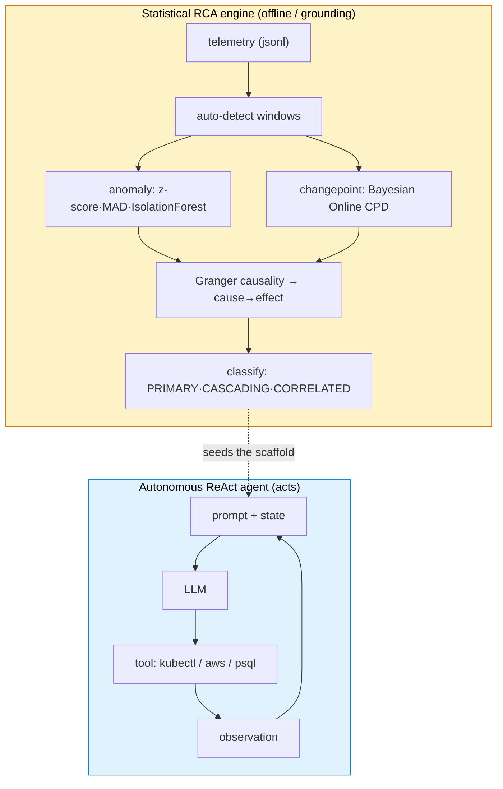

# OATS: Can an AI agent actually diagnose a production incident — and prove it?

*Repo: https://github.com/4sgupta828/oats · autonomous ReAct SRE agent + statistical RCA engine · event-sourced, resumable*

---

## The 2 a.m. industry problem

Something is on fire. An engineer spends the first painful hour on the same ritual — pull metrics, tail logs, run `kubectl` and `aws` — and then the *hard* part: guess which anomaly is the **cause** versus a downstream **symptom**, and map how far it spread. It's slow, stressful, and the reasoning almost never gets written down.

"AIOps" has promised to fix this for a decade and mostly shipped dashboards that tell you *what* changed, not *why*. The gap is causal, and it's expensive: MTTR is dominated by *diagnosis*, not repair.

## Framed as a research problem

| | |
|---|---|
| **Input** | Live telemetry (metrics/logs/traces) + a natural-language goal |
| **Output** | A structured RCA: primary symptom, cascade chain, blast radius, evidence |
| **Two sub-problems** | (1) *Detection & causality* — separate cause from symptom in noisy signals. (2) *Investigation* — take actions in a live system to confirm |
| **Central claim** | Neither an LLM alone nor statistics alone is enough. Statistics find candidate causes; the agent *acts* to confirm; humans stay in the loop |
| **Hard constraint** | An agent that runs commands in prod must be auditable, interruptible, and reversible — or it can't be allowed to act at all |

## The architecture: two modes, one system



The agent is a real **ReAct loop**, event-sourced so every step is auditable and resumable:

```python
# services/agent/reactor/agent_controller.py
while state.turn_count < state.max_turns:      # turn-budget governance (warn @ 50/75/90%)
    emit("turn_started"); check_abort(); check_feedback()   # human can interrupt any turn
    thought, action = parse(llm(build_prompt(state)))
    observation = tools.execute(action)        # or finish → PAUSE for human review
    state.append(observation)
```

Tools are auto-discovered capabilities — the agent *acts*, it doesn't just describe:

```python
@uf(name="execute_shell", version="2.1.0",
    description="Executes a shell command ... shows the exact command being executed.")
```

## What AI solves — and what must stay code

| Task | Owner | Why |
|---|---|---|
| Choose the next investigative step; read heterogeneous evidence | **LLM (agent)** | Orchestration & synthesis — its strength |
| Write a coherent RCA narrative a human can act on | **LLM** | Language |
| "Did metric A *cause* B, or just correlate?" | **Statistics** (Granger, changepoint) | Causality is not a vibe |
| What is safe to run? Read vs. write? Blast radius? | **Code + policy** | Permissions, not prompts |

## What stays genuinely hard (open problems)

1. **Grounding in messy telemetry** — dropped metrics, clock skew, sampling, and cascades that *look* like the cause. Lab detection ≠ detection under a retry storm.
2. **Trust vs. autonomy** — an agent executing in prod is powerful and terrifying. Auditability, interruptibility, reversibility aren't features; they're the license to operate.
3. **Convergence** — stopping the agent from burning its whole budget chasing a dead end. Turn-budget governance helps; efficient investigation is open.
4. **Correlation ≠ causation at scale** — the eternal one; the statistical scaffold exists precisely so the LLM doesn't guess.

## How to take it from here

- Pluggable provider abstraction (CloudWatch, Datadog, X-Ray, GitHub) — not one vendor.
- **Model produces data; UI picks the visualization** — a universal artifact contract kills chart-type hallucination.
- Score RCA against *labeled* incidents (see the sibling project, **Dataraft**) — otherwise you can't tell a good agent from a confident one.

## Use cases → products

| Use case | Product shape |
|---|---|
| First-responder on-call | "AI on-call" copilot that drafts RCA + remediation before a human joins |
| Post-incident review | Auto-generated timeline + blast radius + narrative |
| Existing observability stacks | A causal-RCA layer that sits underneath |
| Regulated ops | An audit-trailed, interruptible investigation record |

## To understand this space better

Granger causality · Bayesian Online Changepoint Detection · `ruptures`, `drain3` (log-template mining) · the **ReAct** agent paper · Datadog Watchdog · the AIOps / incident-management literature.

---

*The leap isn't a chatbot that describes your infra — it's an agent that investigates it, backed by statistics that actually find causes, governed tightly enough to let it act.*

**#SRE #AIOps #DevOps #Observability #IncidentManagement #AIAgents #RCA #ProductManagement**
