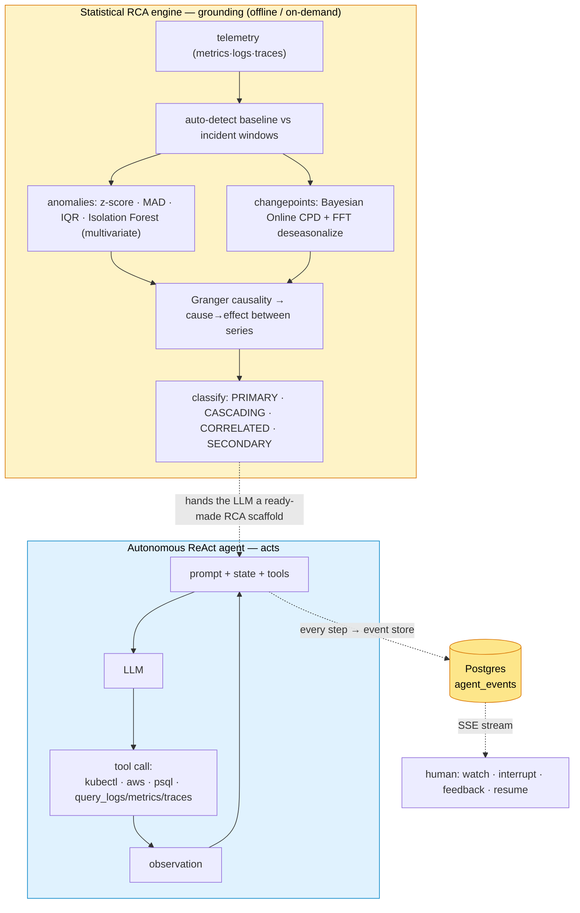

# OATS: An AI agent that diagnoses production incidents — and the engineering discipline that lets it act

*Repo: https://github.com/4sgupta828/oats · autonomous ReAct SRE agent + statistical RCA engine · event-sourced, interruptible, resumable · dual-LLM (Claude / OpenAI)*

> **TL;DR for the people who own reliability and its budget:** Mean-time-to-resolution is dominated by *diagnosis*, not repair — the part where a human stares at telemetry guessing which anomaly is the cause and which is a symptom. "AIOps" has mostly shipped dashboards that say *what* changed, not *why*. OATS pairs a statistical engine that actually separates cause from cascade (changepoint detection, Granger causality) with an autonomous agent that investigates the live system using real tools — and it's built event-sourced, interruptible, and resumable, because an agent that runs commands in production has to be governable before it's allowed to be useful.

---

## 1. The problem, in the language of an on-call budget

It's 2 a.m. Checkout is throwing 5xx. An engineer begins the same ritual: pull metrics, tail logs, run `kubectl`, run `aws`. Then comes the expensive part — the part no dashboard does — separating the **root cause** from the ten **downstream symptoms** it triggered, and mapping how far the damage spread.

That diagnostic phase is where the minutes (and the revenue, and the SLA credits) go. And when it's over, the reasoning almost never gets written down, so the next incident starts from zero.

The industry has thrown a decade at this under the banner of "AIOps" and mostly delivered better *observability* — which tells you *what* changed. The unsolved part is *causal*: **why**, and **what to do about it**.

## 2. Why the two obvious approaches each fall short

| Approach | Strength | Why it isn't enough |
|---|---|---|
| **Dashboards / anomaly alerts** | Surface *what* moved | Every symptom lights up too. You get 40 red panels and no causal ordering — the human still has to reason about cause vs. effect |
| **LLM-only "AI SRE"** | Reads heterogeneous evidence, writes a nice summary | A language model *guesses* causality. "Metric A spiked when B did" is correlation; asking a model to intuit the direction is exactly where it hallucinates a confident, wrong root cause |

The lesson OATS is built on: **neither statistics alone nor an LLM alone is sufficient.** Statistics can *find candidate causes* rigorously but can't investigate a live system. An LLM can *investigate and synthesize* but can't be trusted to derive causality. So you compose them — and you put a human in the loop by construction.

## 3. The architecture: two modes, one governed loop



The agent is a real **Reason → Act → Observe** loop, and the important engineering is what wraps it:

```python
# services/agent/reactor/agent_controller.py
while state.turn_count < state.max_turns:        # turn-budget governance (warn @ 50/75/90%)
    emit("turn_started")                         # event-sourced: every step is a Postgres row
    check_abort()                                # a human can kill it mid-loop
    check_feedback()                             # ...or inject guidance without restarting
    thought, action = parse(llm(build_prompt(state)))
    observation = tools.execute(action)          # or `finish` → PAUSE (not exit) for human review
    state.append(observation)
```

Tools are auto-discovered capabilities — the agent *acts*, it doesn't merely describe:

```python
@uf(name="execute_shell", version="2.1.0",
    description="Executes a shell command ... shows the exact command being executed.")
```

**Why event-sourcing, specifically?** Because an autonomous agent with cluster-wide read and account-wide AWS access is powerful and frightening. Making every turn an immutable event in Postgres — streamed live over SSE — is what turns "a bot loose in prod" into "an auditable, interruptible, resumable investigation." `finish` *pauses* rather than terminates, so a human reviews before anything is closed out. That is not a feature; it is the license to operate.

## 4. The statistical engine, in depth (why it's not just a prompt)

The offline engine is where the real RCA rigor lives, and every piece is a deliberate answer to a failure mode:

| Method | The failure mode it defeats |
|---|---|
| **Auto-detected windows** (no hardcoded incident times) | Real incidents don't announce their start; hardcoding windows makes the tool useless post-hoc and live |
| **Bayesian Online Changepoint Detection** | Finds *when* each series actually broke, robustly, under noise |
| **Isolation Forest (multivariate)** | Anomalies that only show up in the *interaction* of metrics, not any single one |
| **Granger causality** | The crown jewel: infers cause→effect *direction* between metric series, so "DB latency → API errors" isn't reversed |
| **FFT seasonality removal** | Stops a normal daily peak from being flagged as the incident |

The output isn't "here are anomalies." It's a *classified* structure — primary symptom, cascade chain, blast radius — that the LLM builds on rather than rediscovers. That hand-off is the whole trick: the model does synthesis and investigation; the statistics do causality.

## 5. Decisions and tradeoffs

| Decision | Alternative rejected | What we gave up | Why |
|---|---|---|---|
| Statistics find causes; LLM investigates | LLM does everything | Simplicity of one prompt | An LLM cannot be trusted to derive causality; correlation ≠ causation is not a solvable prompt |
| Event-sourced, interruptible agent | Fire-and-forget agent run | Latency & storage overhead | Auditability + reversibility are the precondition for letting an agent act in prod |
| `finish` pauses for human review | Agent auto-closes the incident | Full autonomy | High-stakes actions need a human gate; pause-not-kill keeps the human in control |
| Model produces data; UI picks the visualization | Let the model choose chart tools | A "richer" agent | Kills chart-type hallucination; a universal artifact-metadata contract decouples model from rendering |
| Pluggable provider abstraction | Wire directly to one vendor | Time-to-first-demo | Same engine runs on CloudWatch / Datadog / X-Ray / GitHub; no lock-in |
| Turn-budget governance (warn 50/75/90%) | Unbounded turns | Occasionally more thorough runs | Bounds cost and forces convergence; the design target is 12-turn investigations → 2–3 |

## 6. The AI-vs-deterministic-code boundary

The same discipline that shows up across this whole family of systems: **the model owns orchestration and language; code owns causality, safety, and structure.**

- **LLM:** which investigative step next, reading a heterogeneous pile of evidence, writing the human-readable RCA.
- **Code / statistics:** whether A caused B (Granger, changepoint), what's safe to run (tool permissions, read-vs-write, workspace security), how to render output (artifact-metadata contract), and the immutable event log.

Ask the model to do causality and it hallucinates a confident root cause. Ask it to decide what's safe to `kubectl delete` and you've built an outage generator. The boundary is the product.

## 7. How you'd know it works — and the honest gap

The uncomfortable truth about *every* RCA system, including this one: **in production you rarely know the true root cause**, so you can't score yourself on real incidents. Which is why measurement can't live inside the agent — it needs *labeled* incidents.

That's the entire reason a sibling project exists — **Dataraft** — a simulator that manufactures incidents with a *known* root cause, so an RCA agent like OATS can be scored against ground truth: did it name the right node, and did it separate cause from cascade? Governance metrics you *can* measure directly today — turn-budget adherence, convergence rate, human-intervention frequency — but "is the diagnosis correct" is only honestly answerable against labeled data. Saying so out loud is part of the discipline.

## 8. What stays genuinely hard (open problems)

1. **Grounding in messy telemetry** — dropped metrics, clock skew, sampling, and cascades that *look* like the cause. Lab-clean detection ≠ detection under a retry storm.
2. **Convergence** — keeping the agent from burning its budget down a dead end. Turn-budget helps; efficient investigation policy is open research.
3. **Trust calibration** — how much autonomy to grant for which action classes, and how to earn more over time.
4. **Correlation vs. causation at scale** — the eternal one; the statistical scaffold exists precisely so the LLM never has to guess.

## 9. How to take it from here

- Score continuously against Dataraft's labeled incidents; treat RCA accuracy as a tracked metric, not a claim.
- Expand the provider abstraction to production telemetry backends.
- Graduate the runtime from in-process threads to isolated per-incident execution (the K8s-Job topology is scaffolded).
- Widen the safe-action envelope carefully, gated by measured trust.

## 10. Use cases → products

| Use case | Product |
|---|---|
| First response | An "AI on-call" copilot that drafts the RCA + remediation before a human joins |
| Post-incident | Auto-generated timeline, blast radius, and narrative — the write-up that never gets written |
| Under existing observability | A causal-RCA layer beneath Datadog/CloudWatch/etc. |
| Regulated ops | An interruptible, fully-audited investigation record |

## 11. To understand the space

Granger causality · Bayesian Online Changepoint Detection · `ruptures` · `drain3` (log-template mining) · the **ReAct** agent paper · event sourcing / CQRS · Datadog Watchdog · the AIOps / incident-management literature.

---

*The leap isn't a chatbot that describes your infrastructure — it's an agent that investigates it, backed by statistics that actually find causes, governed tightly enough that you'd let it act.*

**#SRE #AIOps #DevOps #Observability #IncidentManagement #AIAgents #RCA #PlatformEngineering #ProductManagement**
